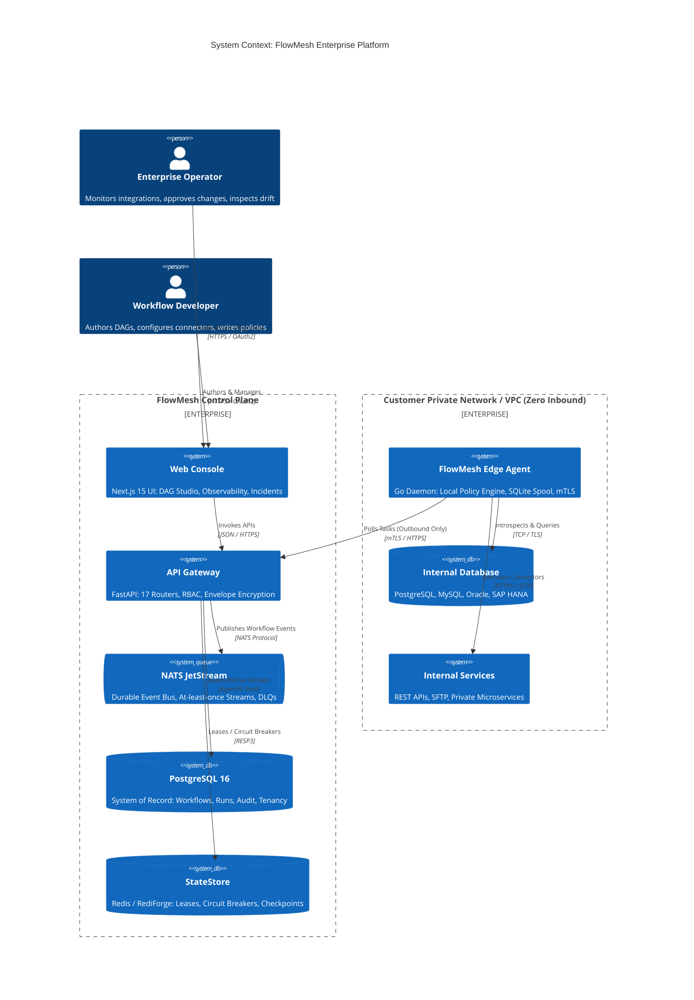
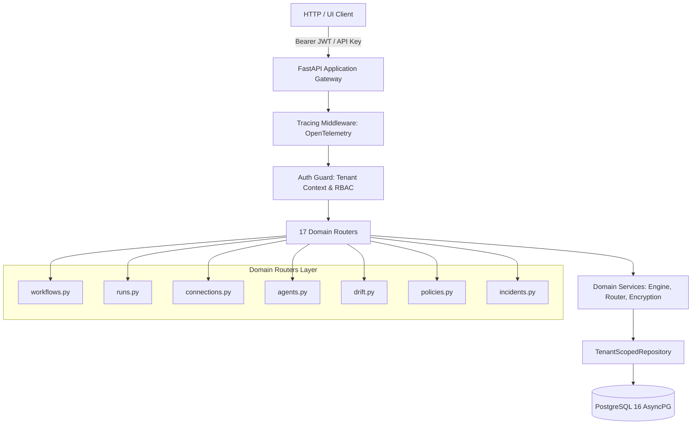
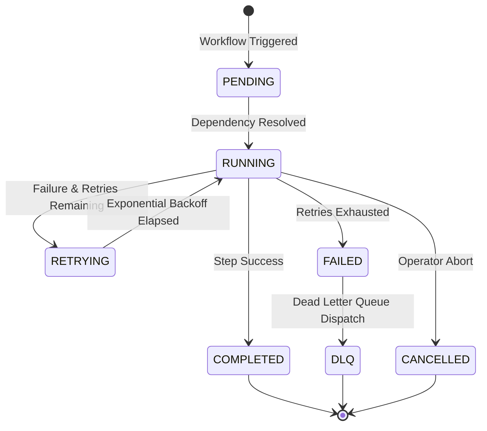
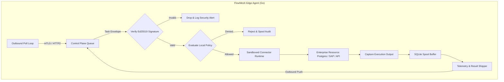
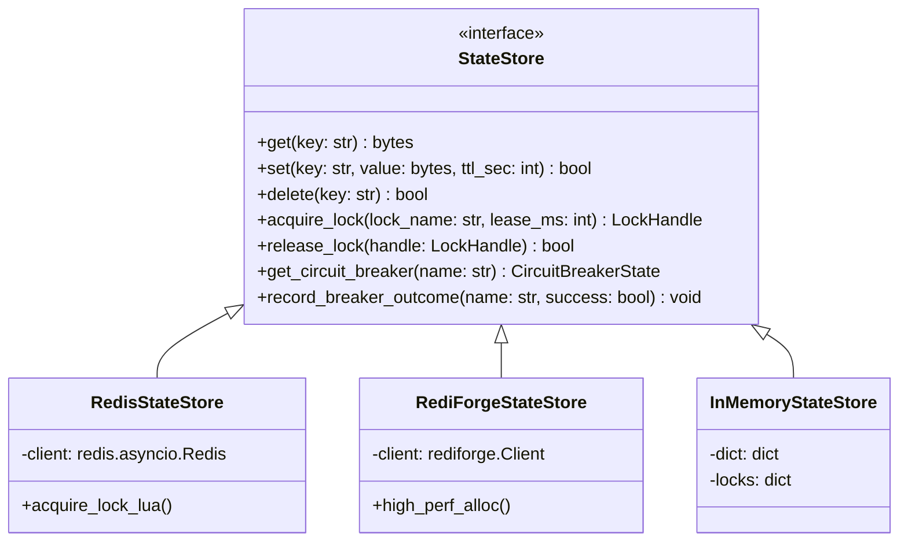
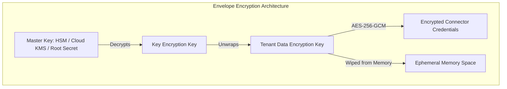

# FlowMesh — System Architecture & Design Specification

<p align="center">
  
  
  
</p>

<p align="center">
  <b> Language / 语言 / 言語 / भाषा / Langue / 언어 / Idioma:</b><br>
  <b>English</b> •
  <a href="./docs/i18n/ARCHITECTURE.ja.md">日本語</a> •
  <a href="./docs/i18n/ARCHITECTURE.zh.md">简体中文</a> •
  <a href="./docs/i18n/ARCHITECTURE.hi.md">हिन्दी</a> •
  <a href="./docs/i18n/ARCHITECTURE.fr.md">Français</a> •
  <a href="./docs/i18n/ARCHITECTURE.ko.md">한국어</a> •
  <a href="./docs/i18n/ARCHITECTURE.es.md">Español</a>
</p>

---

## Table of Contents

- [1. Executive Architectural Overview](#1-executive-architectural-overview)
- [2. Architectural Principles & Tenets](#2-architectural-principles--tenets)
- [3. System Context & C4 Architecture Topology](#3-system-context--c4-architecture-topology)
- [4. Control Plane Architecture (FastAPI & Python 3.12+)](#4-control-plane-architecture-fastapi--python-312)
  - [4.1 Router Decomposition](#41-router-decomposition)
  - [4.2 The `TenantScopedRepository<T>` Pattern](#42-the-tenantscopedrepositoryt-pattern)
  - [4.3 Database Persistence & Async SQLAlchemy 2.0](#43-database-persistence--async-sqlalchemy-20)
- [5. Data Plane & Distributed Workflow Engine](#5-data-plane--distributed-workflow-engine)
  - [5.1 DAG Formulation & Step Resolution](#51-dag-formulation--step-resolution)
  - [5.2 State Machine Lifecycle](#52-state-machine-lifecycle)
  - [5.3 Retries, Exponential Backoff & Dead Letter Queues (DLQ)](#53-retries-exponential-backoff--dead-letter-queues-dlq)
- [6. Edge Execution Plane (Go Static Daemon)](#6-edge-execution-plane-go-static-daemon)
  - [6.1 Outbound-Only mTLS Polling Protocol (ADR-0001)](#61-outbound-only-mtls-polling-protocol-adr-0001)
  - [6.2 Cryptographic Command Signing & Anti-RCE (ADR-0002)](#62-cryptographic-command-signing--anti-rce-adr-0002)
  - [6.3 Embedded SQLite Disconnected Spool Queue](#63-embedded-sqlite-disconnected-spool-queue)
- [7. Messaging & Event Backbone (NATS JetStream)](#7-messaging--event-backbone-nats-jetstream)
  - [7.1 Stream Topologies & Consumer Groups](#71-stream-topologies--consumer-groups)
  - [7.2 CloudEvents 1.0 Serialization & Idempotent Deduplication](#72-cloudevents-10-serialization--idempotent-deduplication)
- [8. StateStore Abstraction & Distributed Consensus (ADR-0003)](#8-statestore-abstraction--distributed-consensus-adr-0003)
  - [8.1 Universal Interface & Driver Implementations](#81-universal-interface--driver-implementations)
  - [8.2 Atomic Distributed Locks (Redlock Lua Scripts)](#82-atomic-distributed-locks-redlock-lua-scripts)
  - [8.3 Atomic Circuit Breakers](#83-atomic-circuit-breakers)
- [9. Security Architecture & Threat Mitigation](#9-security-architecture--threat-mitigation)
  - [9.1 Envelope Encryption Key Hierarchy (AES-256-GCM)](#91-envelope-encryption-key-hierarchy-aes-256-gcm)
  - [9.2 Role-Based Access Control (RBAC) & Scopes](#92-role-based-access-control-rbac--scopes)
  - [9.3 Append-Only Audit Logging & Cryptographic Integrity](#93-append-only-audit-logging--cryptographic-integrity)
- [10. Schema Discovery & Drift Detection Engine](#10-schema-discovery--drift-detection-engine)
- [11. Distributed Observability & Telemetry](#11-distributed-observability--telemetry)
  - [11.1 W3C TraceContext Distributed Propagation](#111-w3c-tracecontext-distributed-propagation)
  - [11.2 Prometheus Metrics & Liveness Probes](#112-prometheus-metrics--liveness-probes)
- [12. Disaster Recovery & Network Partition Resilience](#12-disaster-recovery--network-partition-resilience)
- [13. Architecture Decision Records (ADR) Matrix](#13-architecture-decision-records-adr-matrix)

---

## 1. Executive Architectural Overview

**FlowMesh** is a distributed, event-driven enterprise integration platform engineered to orchestrate mission-critical workflows across heterogeneous systems—on-premise databases, enterprise resource planning (ERP) suites, cloud microservices, and external third-party APIs.

Unlike conventional integration-platform-as-a-service (iPaaS) offerings, FlowMesh is designed from first principles to operate in **zero-trust, data-sovereign enterprise environments**. It delivers cloud-native orchestration capabilities without requiring organizations to expose ingress firewall ports or entrust plaintext credentials to third-party multitenant SaaS vendors.

---

## 2. Architectural Principles & Tenets

FlowMesh adheres to eight non-negotiable architectural tenets:

1. **Zero Inbound Attack Surface**: The control plane never initiates inbound network connections into customer data centers or private VPCs. Edge Agents operate exclusively via outbound TLS tunnels.
2. **Deterministic & Replayable Execution**: Workflows are modeled as immutable, acyclic directed graphs (DAGs). Every step transition emits a state event allowing complete replayability from points of failure.
3. **Defense in Depth & Cryptographic Verification**: Execution commands dispatched to edge runtimes must be cryptographically signed by the control plane and validated against local declarative policies before execution.
4. **Decoupled State Engine**: State management (leases, locks, checkpoints, circuit breakers) is abstracted behind a uniform contract, supporting Redis, high-performance RediForge, or embedded memory engines.
5. **Multi-Tenancy by Construction**: Strict logical isolation is enforced at the data layer via the `TenantScopedRepository` pattern, prohibiting tenant identifier cross-contamination.
6. **Stateless Control Plane**: Control plane instances maintain zero local ephemeral state. Any gateway instance can process any request, enabling seamless horizontal auto-scaling.
7. **End-to-End Observability**: Every operation carries W3C distributed trace context across HTTP boundaries, message queues, and edge workers.
8. **Graceful Degradation over Hard Failure**: Edge nodes maintain local SQLite spools to absorb upstream WAN disconnects without losing data or failing local processing.

---

## 3. System Context & C4 Architecture Topology



---

## 4. Control Plane Architecture (FastAPI & Python 3.12+)

The Control Plane serves as the system's management gateway, orchestrator, and security boundary.



### 4.1 Router Decomposition
The API surface is cleanly decomposed into 17 specialized routers in `apps/api/app/routers/`:
- `workflows`: Workflow definition lifecycle, DAG validation, and compilation.
- `runs`: Run initialization, manual execution triggers, step replay, and cancellation.
- `agents`: Edge agent enrollment, token rotation, heartbeat ingestion, and command dispatch.
- `connections`: Secure connector endpoint registration, credential configuration, and health testing.
- `drift`: Schema introspection capture, baseline pinning, and semantic drift calculations.
- `policies`: Policy-as-code deployment evaluation and pre-flight compliance rules.
- `incidents`: Incident management, failure clustering, and AI-assisted root cause analysis.
- `state`: Real-time inspection of distributed locks and circuit breaker statuses.
- `audit`: Query interface for immutable tenant audit logs.
- `observability`: Live trace visualization, span correlation, and latency metrics.

### 4.2 The `TenantScopedRepository<T>` Pattern
To ensure strict multi-tenant data separation and eliminate cross-tenant data leaks, FlowMesh enforces the `TenantScopedRepository` pattern:

```python
class TenantScopedRepository(Generic[T]):
    """Guarantees that every database interaction is bound to an authenticated tenant_id."""
    def __init__(self, session: AsyncSession, tenant_id: str):
        self._session = session
        self._tenant_id = tenant_id

    async def get_by_id(self, entity_id: str) -> Optional[T]:
        stmt = (
            select(self._model)
            .where(self._model.id == entity_id)
            .where(self._model.tenant_id == self._tenant_id)
        )
        result = await self._session.execute(stmt)
        return result.scalar_one_or_none()
```
Direct queries omitting the tenant predicate are banned by automated linters and code health checks.

### 4.3 Database Persistence & Async SQLAlchemy 2.0
- Connection pooling is configured via `asyncpg` with strict connection timeouts and pool pre-pinging.
- Migrations are managed declaratively using Alembic revision scripts.
- Foreign keys utilize `ON DELETE RESTRICT` for audit logs and connections to guarantee referential durability.

---

## 5. Data Plane & Distributed Workflow Engine

The FlowMesh Data Plane is an asynchronous, event-driven state machine that orchestrates distributed DAG tasks.

### 5.1 DAG Formulation & Step Resolution
Workflows are declared using the schema defined in `packages/workflow-schema/`:
- Steps declare explicit dependency sets via `depends_on: list[str]`.
- The engine computes a topological sort upon compilation.
- Steps without unmet dependencies are dispatched concurrently.
- Conditional branches (`switch`, `parallel`, `join`) evaluate deterministic expressions against step outputs.

### 5.2 State Machine Lifecycle



### 5.3 Retries, Exponential Backoff & Dead Letter Queues (DLQ)
When a step execution encounters a transient fault (e.g., downstream socket timeout):
1. The engine checks the step's `retry_policy` (max attempts, base delay, max delay, backoff factor).
2. Delay is calculated using exponential backoff with full jitter:
   $$\text{Delay} = \min(\text{MaxDelay}, \text{BaseDelay} \times \text{Factor}^{\text{attempt}}) \times \text{Uniform}(0.5, 1.5)$$
3. If max attempts are exhausted, the step transitions to `FAILED`. If configured, an event is emitted to the tenant's dedicated Dead Letter Queue (`flowmesh.dlq.{tenant_id}`) for operator triage.

---

## 6. Edge Execution Plane (Go Static Daemon)

The FlowMesh Edge Agent is a statically compiled Go daemon designed to run within secured customer networks.



### 6.1 Outbound-Only mTLS Polling Protocol (ADR-0001)
As codified in **ADR-0001**, corporate security policies forbid inbound listening ports on external firewalls:
- The agent establishes long-lived outbound TLS 1.3 connections to the control plane.
- Authentication utilizes bidirectional certificate verification (mTLS) with client certificates bound to a specific `agent_id` and `tenant_id`.
- If connectivity is lost, the agent employs backoff reconnection loops without impacting local network services.

### 6.2 Cryptographic Command Signing & Anti-RCE (ADR-0002)
To completely prevent Remote Code Execution (RCE) vectors (**ADR-0002**):
- Commands contain strictly structured JSON payloads specifying the connector name, operation verb, and parameters.
- Free-form bash, powershell, or shell invocation strings are structurally prohibited.
- The control plane signs every task envelope using a private Ed25519 signing key.
- The agent validates the cryptographic signature using the embedded control plane public key before parsing the payload.

### 6.3 Embedded SQLite Disconnected Spool Queue
If an edge location experiences WAN degradation:
- Execution outcomes, heartbeats, and audit logs are spooled into a local transactional SQLite database (`agent_spool.db`).
- Upon WAN restoration, a persistent worker drains the spool sequentially using monotonic transaction order.

---

## 7. Messaging & Event Backbone (NATS JetStream)

FlowMesh utilizes NATS JetStream 2.10+ as its high-performance, resilient event bus.

### 7.1 Stream Topologies & Consumer Groups
- **Stream `FLOWMESH_EVENTS`**: Retains all workflow triggers, step completions, and state transitions.
  - Storage: File-backed persistent storage.
  - Retention: Limits-based (retention based on age or size).
- **Stream `FLOWMESH_COMMANDS`**: Carries task dispatches to edge agent queues.
  - Subject Hierarchy: `flowmesh.commands.{tenant_id}.{agent_id}`.
- **Consumer Groups**: Scalable, load-balanced consumer groups process background jobs across control plane workers.

### 7.2 CloudEvents 1.0 Serialization & Idempotent Deduplication
All events comply with the CNCF CloudEvents 1.0 specification.
- Each message sets the `Nats-Msg-Id` header to a deterministic hash:
  $$\text{Msg-Id} = \text{SHA256}(\text{tenant\_id} + \text{run\_id} + \text{step\_id} + \text{attempt})$$
- NATS JetStream deduplication windows discard duplicate dispatches during network retries, ensuring strictly idempotent at-least-once delivery.

---

## 8. StateStore Abstraction & Distributed Consensus (ADR-0003)

The `packages/state-store/` package provides a unified contract for distributed coordination:



### 8.1 Universal Interface & Driver Implementations
- **Redis Driver**: Production driver backed by standard Redis 7+ clusters.
- **RediForge Driver**: High-throughput driver optimized for microsecond-latency state caches.
- **In-Memory Driver**: Zero-dependency embedded driver for local development and lightning-fast unit tests.

### 8.2 Atomic Distributed Locks (Redlock Lua Scripts)
Distributed synchronization (e.g., preventing duplicate simultaneous triggers of the same cron workflow) utilizes atomic Lua scripts:
```lua
-- Acquire Lock with TTL
if redis.call('set', KEYS[1], ARGV[1], 'NX', 'PX', ARGV[2]) then
    return 1
else
    return 0
end
```
Lease renewal workers refresh the TTL periodically while the task is active.

### 8.3 Atomic Circuit Breakers
To safeguard external enterprise systems from cascading failures:
- Circuit breakers monitor failure rates over a sliding window.
- States: `CLOSED` (normal operation), `OPEN` (tripped, all requests fast-fail), `HALF_OPEN` (canary test requests allowed).
- State transitions are executed atomically within Redis/RediForge via Lua scripts.

---

## 9. Security Architecture & Threat Mitigation

FlowMesh implements enterprise defense-in-depth principles across all components.



### 9.1 Envelope Encryption Key Hierarchy (AES-256-GCM)
Sensitive connection credentials (e.g., production database passwords, Stripe API keys) are never stored in plain text:
1. **Root Key Encryption Key (KEK)**: Configured via external environment secrets or hardware security modules (HSMs).
2. **Tenant Data Encryption Key (DEK)**: Unique per tenant, encrypted using the KEK and stored in the database.
3. **Payload Encryption**: Specific secret fields are encrypted using authenticated **AES-256-GCM** with a random 96-bit initialization vector (IV) and authentication tag.

### 9.2 Role-Based Access Control (RBAC) & Scopes
FlowMesh enforces four distinct access tiers:
- **`owner`**: Complete administrative authority, billing management, credential deletion, member management.
- **`operator`**: Run manual workflow executions, view audit logs, manage incident responses, toggle circuit breakers.
- **`developer`**: Author and update workflow DAGs, view schemas, test connector connections.
- **`viewer`**: Read-only access to execution graphs, status dashboards, and metrics.

### 9.3 Append-Only Audit Logging & Cryptographic Integrity
All mutating API actions record an append-only audit entry in PostgreSQL containing:
- Authenticated user identifier and source IP.
- Mutation timestamp and action verb.
- Cryptographic hash chaining: Each record stores the SHA-256 digest of the preceding audit record, making historical log tampering mathematically detectable.

---

## 10. Schema Discovery & Drift Detection Engine

FlowMesh features an automated engine to manage schema evolution across corporate data sources:

1. **Introspection Phase**: The connector introspects structural metadata (tables, columns, data types, nullability, foreign keys).
2. **Baseline Locking**: An operator approves a snapshot as the official canonical baseline.
3. **Drift Evaluation**: Periodic jobs compare the live state against the baseline:
   - **`WARNING` (Non-Breaking)**: New optional columns, table additions, relaxed constraints.
   - **`CRITICAL` (Breaking)**: Dropped columns, altered data types, new non-null constraints without default values.
4. **Policy Enforcement**: Critical drift triggers automatic workflow pauses and notifies operators to prevent data corruption.

---

## 11. Distributed Observability & Telemetry

### 11.1 W3C TraceContext Distributed Propagation
FlowMesh instruments all execution paths using the OpenTelemetry standard:
- Inbound HTTP requests ingest or create `traceparent` and `tracestate` headers.
- When the API Gateway dispatches a task to NATS JetStream, trace headers are injected into the NATS message metadata.
- The Edge Agent extracts the trace context, linking connector execution spans back to the initial HTTP trigger.

### 11.2 Prometheus Metrics & Liveness Probes
The control plane exposes standard OpenMetrics at `/metrics`:
- `flowmesh_workflow_executions_total{tenant_id, status}`
- `flowmesh_workflow_execution_duration_seconds{tenant_id}`
- `flowmesh_circuit_breaker_state{connector_id}`
- `flowmesh_agent_heartbeat_timestamp{agent_id}`
- Liveness probe: `/health` (instant HTTP 200).
- Readiness probe: Checks connectivity to PostgreSQL, Redis, and NATS before accepting traffic.

---

## 12. Disaster Recovery & Network Partition Resilience

| Failure Scenario | Mitigation Mechanism | Recovery Time Objective (RTO) | Recovery Point Objective (RPO) |
| :--- | :--- | :--- | :--- |
| **Control Plane Node Crash** | Stateless API gateway behind load balancer automatically fails over | $< 3\text{ seconds}$ | $0\text{ seconds}$ (no data lost) |
| **Edge Agent WAN Disconnect** | Embedded SQLite queue spools output locally; auto-resumes upon reconnection | Automatic upon WAN recovery | $0\text{ seconds}$ (buffered) |
| **Redis / StateStore Outage** | Workflow engine pauses active steps; resumes from durable PostgreSQL checkpoints | Upon Redis recovery | $0\text{ seconds}$ |
| **NATS Broker Failure** | NATS JetStream file clustering (Raft consensus); message re-delivery | $< 5\text{ seconds}$ | $0\text{ seconds}$ (durable stream) |
| **Database Failure** | PostgreSQL 16 streaming replication with automated failover | $< 30\text{ seconds}$ | $< 1\text{ second}$ |

For detailed step-by-step multi-region setups, cloud infrastructure (Terraform, Kubernetes, Cloudflare Anycast), and edge enrollment, see the complete [Global Deployment Guide](file:///c:/Desktop/CODING%20_IS_LIFE/1%20ANTI%20GRAVITY/ENTERPISE%20WORKFLOW/docs/GLOBAL_DEPLOYMENT.md).

---

## 13. Architecture Decision Records (ADR) Matrix

| ADR ID | Title | Status | Primary Architectural Impact |
| :--- | :--- | :--- | :--- |
| **[ADR-0001](docs/adr/ADR-0001-agent-outbound-only.md)** | Outbound-Only Architecture for Edge Agent | **Accepted** | Eliminates inbound firewall openings; all traffic initiated outbound via mTLS. |
| **[ADR-0002](docs/adr/ADR-0002-no-remote-code-execution.md)** | Rejection of Arbitrary Remote Code Execution | **Accepted** | Mandates cryptographic Ed25519 payload signing and strict declarative connector schemas. |
| **[ADR-0003](docs/adr/ADR-0003-statestore-abstraction.md)** | Generic StateStore Abstraction for Redis & RediForge | **Accepted** | Decouples orchestration engine from concrete cache backends; enables pluggable high-perf state. |
| **[ADR-0004](docs/adr/ADR-0004-immutable-workflow-versions.md)** | Immutable Workflow Versioning and Pinning | **Accepted** | Guarantees in-flight executions finish on their pinned version; instant zero-downtime rollbacks. |

---

## Document Metadata

- **Authors**: FlowMesh Core Architecture & Engineering Team
- **Status**: Production Reference Standard (Approved)
- **Classification**: Open Architecture Document
- **Applicable Software Version**: FlowMesh v1.0.0+
