# FlowMesh Enterprise - Agile Engineering & Scrum Delivery Framework

FlowMesh engineering operates on a mature **Agile / Scrum** delivery model tailored for high-reliability, distributed enterprise systems. This document outlines our squad ceremonies, estimation methodology, Definition of Ready/Done, and metrics tracking.

---

## 1. Squad Structure & Ceremonies Cadence

FlowMesh engineering operates in cross-functional squads on synchronized **2-week sprint cycles**.

```mermaid
gantt
    title FlowMesh 2-Week Sprint Cadence
    dateFormat  D
    axisFormat  Day %d
    section Ceremonies
    Sprint Planning (Capacity & Commitment) :milestone, m1, 1, 0d
    Daily Scrum (15 mins daily)             :active, d1, 1, 10d
    Backlog Refinement (Session 1)          :crit, r1, 4, 1d
    Backlog Refinement (Session 2)          :crit, r2, 8, 1d
    Sprint Review & Stakeholder Demo        :milestone, m2, 10, 0d
    Sprint Retrospective                    :milestone, m3, 10, 0d
```



### 1.1 Ceremony Breakdown

| Ceremony | Timing & Frequency | Timebox | Primary Objective | Key Artifact Produced |
| :--- | :--- | :--- | :--- | :--- |
| **Sprint Planning** | Day 1 (Monday morning) | 2 hours | Part 1: PO presents sprint goal & backlog priorities.<br>Part 2: Squad estimates tasks and commits to sprint backlog. | Committed Sprint Backlog & Sprint Goal |
| **Daily Scrum** | Mon–Fri (Daily standup) | 15 mins | Synchronize daily progress, highlight blockers, and align on pairing opportunities. | Blocker board updates / Slack huddle |
| **Backlog Refinement** | Days 4 & 8 (Mid-sprint) | 1 hour | Deconstruct Epics into INVEST User Stories, clarify acceptance criteria, run Planning Poker. | Refined stories meeting DoR |
| **Sprint Review / Demo** | Day 10 (Friday afternoon) | 1 hour | Demonstrate working, tested software in staging to product owners and stakeholders. | Increment acceptance & feedback log |
| **Sprint Retrospective** | Day 10 (Following demo) | 1 hour | Reflect on squad dynamics, tooling, and delivery blockers using the 4Ls framework (*Liked, Learned, Lacked, Longed For*). | SMART continuous improvement actions |

---

## 2. Story Point Estimation Matrix (Planning Poker)

FlowMesh utilizes modified **Fibonacci sizing** based on three dimensions: **Complexity**, **Uncertainty**, and **Effort**.

| Points | Complexity & Scope | Example in FlowMesh | Typical Duration |
| :---: | :--- | :--- | :---: |
| **1** | Trivial, zero uncertainty, well-known pattern. | Add new MDC header field to `MdcLoggingFilter`. | < 0.5 day |
| **2** | Low complexity, small code footprint, clear tests. | Add REST endpoint to query transactions by status. | 0.5 – 1 day |
| **3** | Moderate complexity, touches multiple components. | Implement `TenantConcurrencyStripingManager` with fine-grained lock striping. | 1 – 2 days |
| **5** | High complexity, external integration, concurrency. | Build `ConcurrentLedgerReconciliationService` with scatter-gather and timeout handling. | 2 – 4 days |
| **8** | Substantial complexity, high risk, cross-cutting. | Implement multi-language SonarQube CI gate with JaCoCo and Pytest coverage. | 4 – 6 days |
| **13+** | **Too Large for a single Sprint Story.** | *Must be broken down into smaller user stories or preceded by a Technical Spike.* | Needs Splitting |

---

## 3. Governance Gates: DoR and DoD

### 3.1 Definition of Ready (DoR) - Entrance Gate
A User Story cannot be committed into an active Sprint unless it satisfies all DoR criteria:
1. **INVEST Model**: Independent, Negotiable, Valuable, Estimable, Small, and Testable.
2. **BDD Acceptance Criteria**: Written in formal *Given / When / Then* syntax.
3. **Architectural Dependencies Resolved**: Data models, API contracts, and schema migrations documented.
4. **Estimated by Squad**: Sized with consensus in Planning Poker (≤ 8 points).
5. **Security & Compliance Tagged**: Flagged if touching PII, encryption keys, or financial ledger balances.

### 3.2 Definition of Done (DoD) - Exit Gate
A User Story is not considered Complete until all DoD criteria are satisfied:
- [x] **Acceptance Criteria Verified**: All automated BDD scenarios pass without regression.
- [x] **Automated Testing**: Unit and integration test coverage ≥ 80% on new code (JaCoCo for Java, Pytest for Python).
- [x] **SonarQube Quality Gate Passed**: **0 Blocker, 0 Critical issues**, Security Rating A, Duplications < 3%.
- [x] **Logging & Observability**: SLF4J MDC trace context populated; `MDC.clear()` executed; audit records created.
- [x] **Concurrency & Memory Review**: Zero race conditions, bounded thread pools with backpressure, and zero static memory leaks.
- [x] **Peer Review**: Minimum of two senior squad code review approvals.
- [x] **CI/CD Build Green**: Docker images built, vulnerability scans clear, deployed to staging.

---

## 4. Git Branching Strategy & Agile Release Trains

FlowMesh adheres to **Trunk-Based Development with Short-Lived Feature Branches**:

```text
  main (Deployable Production)
    │
    ├── feature/FLOW-101-concurrency-striping ──[PR + Sonar Gate]──> Merged to main
    │
    ├── feature/FLOW-102-mdc-logging-filter    ──[PR + Sonar Gate]──> Merged to main
    │
    └── bugfix/FLOW-103-rate-limiter-leak      ──[PR + Sonar Gate]──> Merged to main
```

- **Branch Naming**: `feature/FLOW-<id>-<slug>`, `bugfix/FLOW-<id>-<slug>`, `spike/FLOW-<id>-<slug>`.
- **Branch Lifetime**: Feature branches are kept short-lived (typically 1–3 days) to minimize merge conflicts and enable continuous integration.

---

## 5. Agile Engineering Metrics

To foster continuous improvement, FlowMesh tracks four key delivery metrics:

1. **Squad Velocity**: Total story points accepted per sprint (used for data-driven capacity forecasting).
2. **Sprint Burndown**: Daily remaining story points tracked against the ideal trend line.
3. **Cycle Time**: Time elapsed from when a ticket moves to *In Progress* until it is merged and deployed to production (Target: < 48 hours for standard stories).
4. **Escaped Defect Rate**: Percentage of bugs discovered in staging or production versus during sprint development (Target: < 3%).
