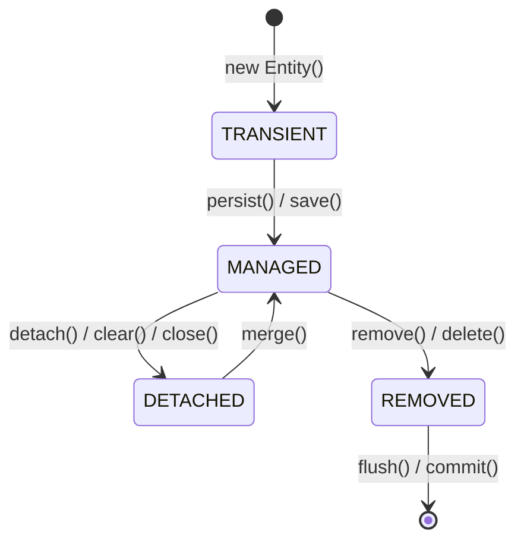
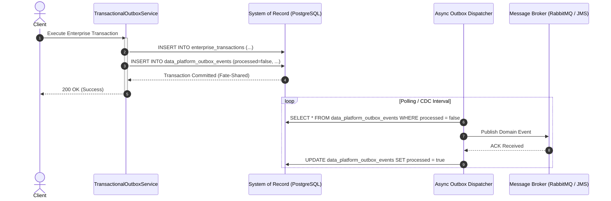

# FlowMesh Enterprise ORM, Jakarta Persistence & Data Platform Engineering Guide

This guide provides deep technical documentation on FlowMesh's Object-Relational Mapping (ORM) architecture, Jakarta Persistence (JPA 3.1) and Hibernate 6 integration, and modern Data Platform Engineering capabilities (Transactional Outbox and Schema Drift Governance).

---

## 1. Hibernate 6 & Jakarta Persistence Architecture

FlowMesh utilizes **Hibernate 6.5+** as the JPA provider within Spring Boot 3.3.x. The architecture bridges relational systems of record with domain-driven aggregates while preventing common distributed systems and performance pitfalls.

### 1.1 The Hibernate Session & Persistence Context Lifecycle
Entities managed by Hibernate transition through four lifecycle states:



- **Transient**: Newly instantiated in Java heap with no database identity (`id == null`). Not associated with any Persistence Context.
- **Managed (Persistent)**: Associated with an active Persistence Context (First-Level Cache). Hibernate tracks every mutation via **Dirty Checking**; changes are synchronized upon transaction commit or explicit `flush()`.
- **Detached**: Possesses a database identity but is no longer associated with an active session (e.g., serialized across an HTTP layer or after `session.clear()`).
- **Removed**: Scheduled for deletion in the underlying database upon the next flush.

### 1.2 First-Level (L1) vs. Second-Level (L2) Cache
1. **First-Level Cache (Persistence Context)**:
   - Scope: Bounded to the single `EntityManager` or `@Transactional` execution thread.
   - Ensures **Repeatable Reads** at the application layer: querying the same entity ID multiple times within a transaction yields the exact same object reference (`e1 == e2`), avoiding duplicate database queries.
2. **Second-Level Cache (L2)**:
   - Scope: Shared across all sessions in the application process or distributed cluster (backed by Redis or RediForge in FlowMesh).
   - Enabled selectively for read-heavy, low-churn reference catalogs.

---

## 2. Solving the $N+1$ Query Problem

The $N+1$ query problem occurs when an application loads an aggregate root with $N$ child associations using lazy loading, resulting in 1 query for the parent followed by $N$ separate queries for the child collections.

### 2.1 The Anti-Pattern
```java
// Naive fetch executes 1 query for 100 transactions:
List<EnterpriseTransaction> txns = repository.findAll();

// Iterating over audit entries triggers 100 additional SELECT queries:
for (EnterpriseTransaction txn : txns) {
    int entries = txn.getAuditEntries().size(); // SELECT * FROM transaction_audit_entries WHERE transaction_id = ?
}
```

### 2.2 The FlowMesh Solution: `@NamedEntityGraph`
FlowMesh eliminates $N+1$ queries declaratively using Named Entity Graphs. In [EnterpriseTransaction.java](file:///c:/Desktop/CODING%20_IS_LIFE/1%20ANTI%20GRAVITY/ENTERPISE%20WORKFLOW/services/enterprise-worker/src/main/java/io/flowmesh/enterprise/model/EnterpriseTransaction.java):

```java
@Entity
@Table(name = "enterprise_transactions")
@NamedEntityGraph(
    name = "EnterpriseTransaction.withAuditEntries",
    attributeNodes = @NamedAttributeNode("auditEntries")
)
public class EnterpriseTransaction {
    @OneToMany(mappedBy = "transaction", cascade = CascadeType.ALL, orphanRemoval = true, fetch = FetchType.LAZY)
    private List<TransactionAuditEntry> auditEntries = new ArrayList<>();
    // ...
}
```

In [EnterpriseTransactionRepository.java](file:///c:/Desktop/CODING%20_IS_LIFE/1%20ANTI%20GRAVITY/ENTERPISE%20WORKFLOW/services/enterprise-worker/src/main/java/io/flowmesh/enterprise/repository/EnterpriseTransactionRepository.java):

```java
@EntityGraph(value = "EnterpriseTransaction.withAuditEntries", type = EntityGraph.EntityGraphType.LOAD)
@Query("SELECT t FROM EnterpriseTransaction t WHERE t.id = :id")
Optional<EnterpriseTransaction> findByIdWithAuditEntries(@Param("id") Long id);
```

**Generated SQL Execution**:
```sql
SELECT 
    t.id, t.amount, t.currency, t.status, t.tenant_id, t.version,
    a.id AS audit_id, a.action, a.actor, a.details, a.performed_at
FROM enterprise_transactions t
LEFT OUTER JOIN transaction_audit_entries a ON t.id = a.transaction_id
WHERE t.id = ? AND (t.deleted = false);
```
Both parent and children are loaded in **1 single query**, providing $O(1)$ roundtrip overhead.

---

## 3. Concurrency Control: Optimistic Locking

To prevent race conditions, dirty writes, and lost updates in high-concurrency environments, FlowMesh adopts **Optimistic Concurrency Control**:

1. **Version Field**: `@Version private Long version;`
2. **Automated Verification**: When updating an existing transaction:
   ```sql
   UPDATE enterprise_transactions 
   SET status = ?, version = version + 1, updated_at = ? 
   WHERE id = ? AND version = ?
   ```
3. **Collision Detection**: If another concurrent thread updated the row between read and write, the `WHERE` clause matches 0 rows. Hibernate intercepts this and throws `ObjectOptimisticLockingFailureException`.

---

## 4. Soft Deletes in Hibernate 6

FlowMesh preserves complete audit trails for compliance (SOC-2, HIPAA, ISO-27001). Records are never physically deleted via `DELETE FROM`:

- **Annotation**:
  ```java
  @SQLDelete(sql = "UPDATE enterprise_transactions SET deleted = true WHERE id = ? AND version = ?")
  @SQLRestriction("deleted = false")
  ```
- **Transparent Filtering**: All JPQL queries and repository calls automatically append `AND deleted = false`.
- **Audit Recovery**: Historical queries can access soft-deleted entries via native queries when running forensic investigations.

---

## 5. Domain-Driven Value Objects & Type Converters

### 5.1 Embeddable MonetaryAmount
Financial amounts require strict scale, precision, and currency isolation:
```java
@Embeddable
public class MonetaryAmount {
    @Column(name = "amount", precision = 18, scale = 2, nullable = false)
    private BigDecimal amount;

    @Column(name = "currency", length = 3, nullable = false)
    private String currency;
}
```

### 5.2 JSON Metadata Converter
Dynamic workflow metadata is seamlessly serialized to JSON text:
```java
@Converter
public class TransactionMetadataConverter implements AttributeConverter<Map<String, Object>, String> {
    // Converts Map <-> JSON String using Jackson ObjectMapper
}
```

---

## 6. Data Platform Engineering

FlowMesh bridges transactional processing and analytical data platforms (Lakehouse, Kafka, Spark) through two core patterns:

### 6.1 Transactional Outbox Pattern
Avoids the distributed dual-write problem by persisting domain events into the `data_platform_outbox_events` table inside the same transaction as state changes.



### 6.2 Data Contracts & Schema Drift Governance
The `DataPlatformSchemaEngine` enforces contracts on incoming event payloads and analyzes schema evolutions:

| Severity Level | Cause | Pipeline Action |
|:---|:---|:---|
| `COMPATIBLE` | Payload matches baseline schema 100%. | Process immediately. |
| `NON_BREAKING_ADDITIVE` | New columns/fields added without dropping or modifying existing fields. | Accept payload; auto-update metadata catalog. |
| `CRITICAL_BREAKING` | Existing columns removed, or data types altered (e.g. NUMBER $\rightarrow$ STRING). | **Reject ingestion**; alert data engineering team. |

---

## 7. Data Platform REST Endpoints

FlowMesh exposes live endpoints for schema contract validation, drift analysis, and outbox operations under `/api/v1/enterprise/dataplatform`:

- `POST /api/v1/enterprise/dataplatform/validate-contract`: Validates a payload against a data contract.
- `POST /api/v1/enterprise/dataplatform/detect-drift`: Compares baseline schema against incoming schema.
- `GET /api/v1/enterprise/dataplatform/outbox/pending-count`: Returns the number of un-dispatched outbox events.
- `POST /api/v1/enterprise/dataplatform/outbox/process`: Triggers outbox dispatch batch.
