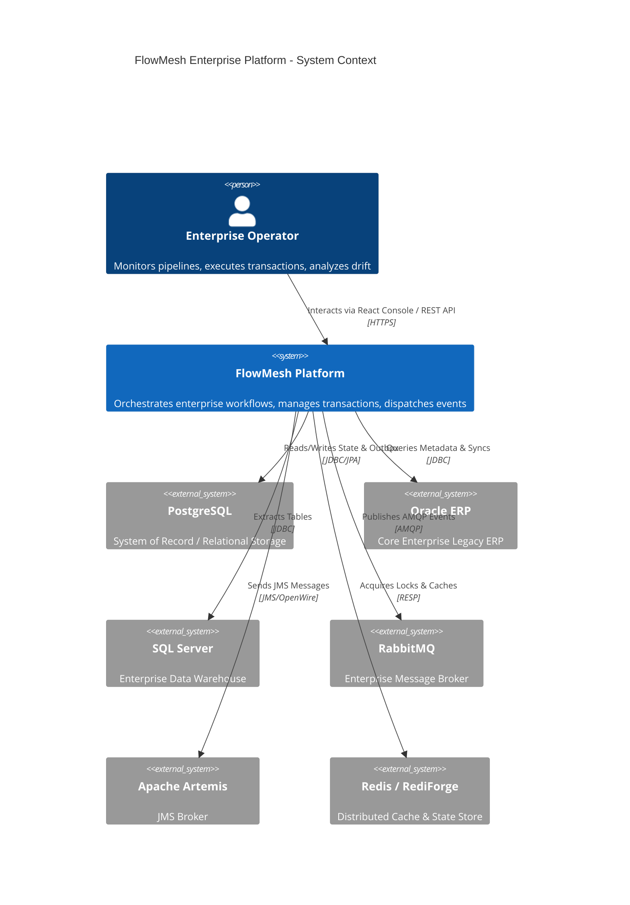
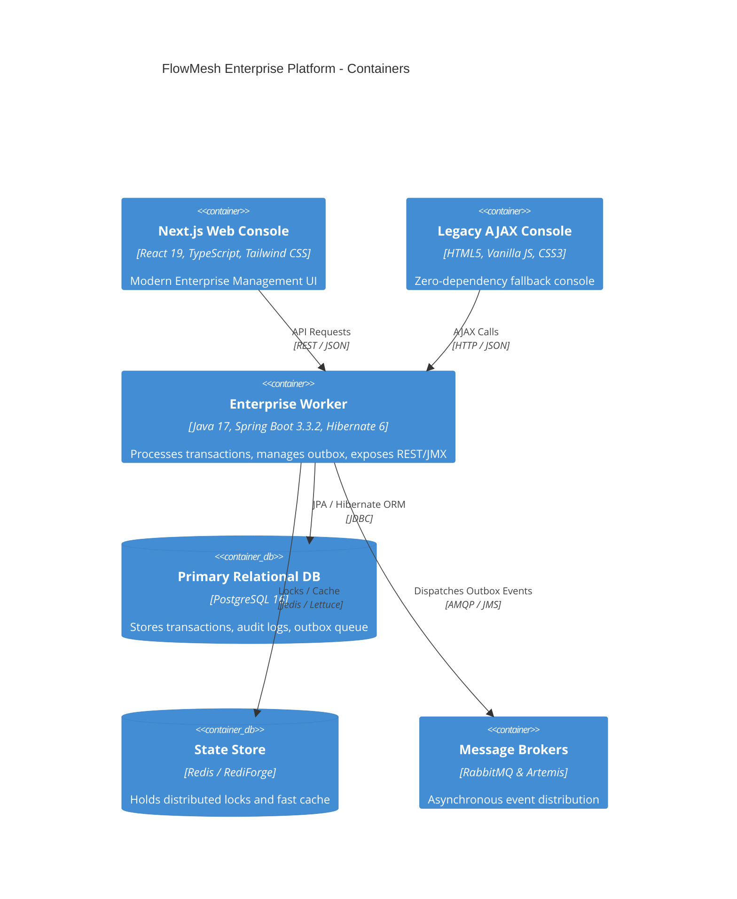
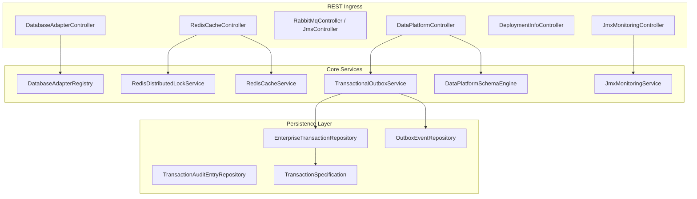
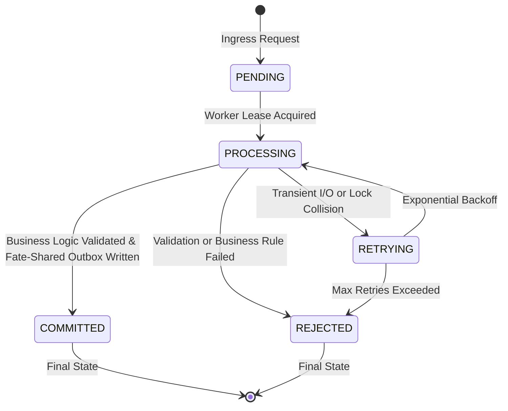
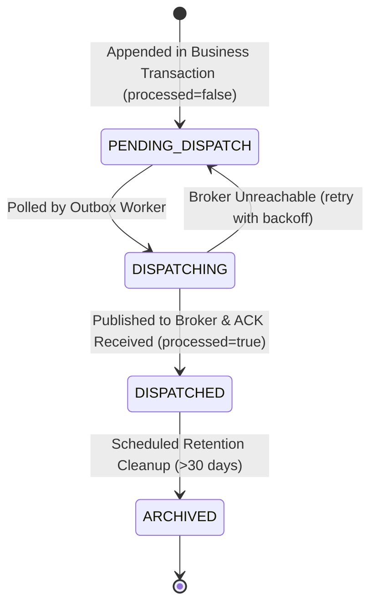
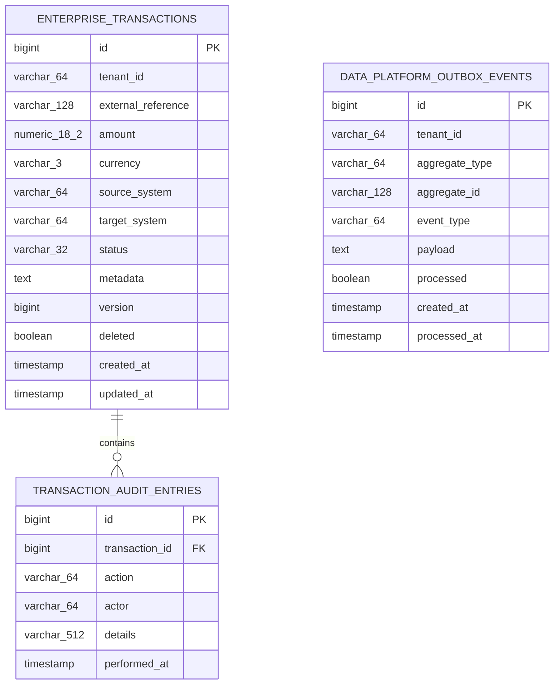

# FlowMesh Enterprise Requirements, System Design & Architecture Specifications

This document defines the formal software engineering requirements, architecture designs, and C4 models for the FlowMesh Enterprise Platform.

---

## 1. Requirements Engineering

### 1.1 Stakeholder Personas
- **Enterprise Architect**: Requires standardized integration patterns (JPA 3.1, Outbox, AMQP/JMS), zero vendor lock-in, and clear architectural boundaries.
- **Data Platform Engineer**: Requires guaranteed at-least-once domain event emission, schema contract enforcement, and automated schema drift detection.
- **Compliance & Security Officer**: Demands immutable audit trails, optimistic concurrency locking, soft deletes, and SOC-2/ISO-27001 traceability.
- **SRE & DevOps Engineer**: Demands JMX/Prometheus telemetry, dual-deployment options (embedded container vs. external Tomcat WAR), and graceful degradation.

### 1.2 Functional Requirements (FR)
| ID | Requirement | Priority | Implementation Component |
|:---|:---|:---|:---|
| **FR-01** | Multi-database adapter layer for PostgreSQL, Oracle, and SQL Server with connection validation and pool statistics. | High | `io.flowmesh.enterprise.adapters.db` |
| **FR-02** | Distributed caching and atomic distributed locking with TTL. | High | `io.flowmesh.enterprise.redis` |
| **FR-03** | Dual-broker enterprise messaging supporting AMQP (RabbitMQ) and JMS (Apache Artemis). | High | `io.flowmesh.enterprise.messaging` |
| **FR-04** | JMX MBean instrumentation for live heap, thread count, transaction throughput, and garbage collection metrics. | Medium | `io.flowmesh.enterprise.monitoring.jmx` |
| **FR-05** | Dual-deployment capability: standalone Spring Boot executable JAR or external Tomcat WAR archive. | High | `io.flowmesh.enterprise.deployment` |
| **FR-06** | Optimistic concurrency control via versioning and non-destructive soft deletes with automatic filtering. | Critical | `io.flowmesh.enterprise.orm` |
| **FR-07** | Transactional Outbox pattern guaranteeing zero event loss and eliminating dual-write anomalies. | Critical | `io.flowmesh.enterprise.dataplatform` |
| **FR-08** | Runtime data contract validation and schema drift classification (`COMPATIBLE`, `NON_BREAKING_ADDITIVE`, `CRITICAL_BREAKING`). | Critical | `io.flowmesh.enterprise.dataplatform.schema` |
| **FR-09** | Modern React enterprise web console with real-time health checks, metrics, and system controls. | High | `apps/web/src/app/enterprise/page.tsx` |
| **FR-10** | Zero-dependency legacy AJAX console (`XMLHttpRequest`) for constrained or legacy browser environments. | Medium | `web-console/legacy-AJAX-demo` |

### 1.3 Non-Functional Requirements (NFR)
- **NFR-01: Performance & Latency**: API endpoints must respond with $p99 < 50\text{ms}$ under standard workload; in-memory caching must respond in $< 2\text{ms}$.
- **NFR-02: Scalability**: Worker service must leverage Java Virtual Threads (Project Loom) to support $> 5,000\text{ TPS}$ per instance without OS thread exhaustion.
- **NFR-03: Zero Data Loss**: Outbox events must be fate-shared with business state in an ACID transaction boundary.
- **NFR-04: Multi-Tenant Isolation**: Database queries and concurrency controllers must stripe work per `tenant_id`.
- **NFR-05: Auditability & Security**: MDC logging filters must propagate `traceId`, `tenantId`, and `userId` across all log messages.
- **NFR-06: Portability**: Tests must run without external dependencies via embedded H2 and embedded Artemis.

---

## 2. System Design & C4 Architecture

### 2.1 C4 Level 1: System Context Diagram

### 2.2 C4 Level 2: Container Diagram

### 2.3 C4 Level 3: Component Diagram (Enterprise Worker)

---

## 3. State Machines & ER Models

### 3.1 Enterprise Transaction Lifecycle

### 3.2 Transactional Outbox Lifecycle

### 3.3 Entity-Relationship (ER) Diagram

