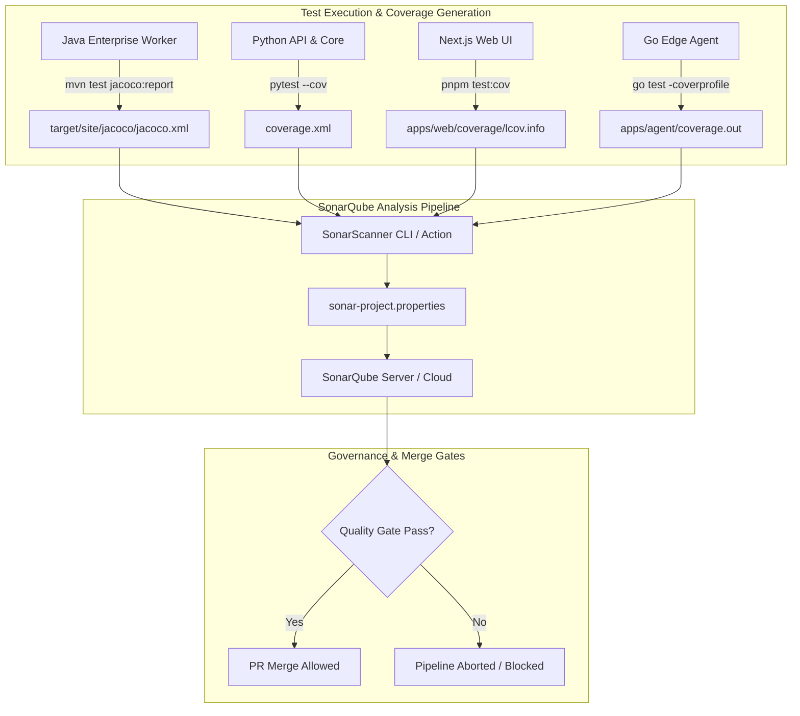

# FlowMesh Enterprise - SonarQube Quality Gates & Code Health

FlowMesh enforces continuous code quality, security analysis, and architectural governance across its polyglot codebase (Python, Java/Spring Boot, TypeScript/Next.js, and Go) using **SonarQube Enterprise**.

---

## 1. Quality Gate Policy ("Clean as You Code")

Every Pull Request must strictly satisfy the FlowMesh Production Quality Gate before merging to `develop` or `main`.

| Metric | Threshold | Scope | Rationale |
| :--- | :---: | :---: | :--- |
| **Code Coverage (JaCoCo / Pytest)** | **≥ 80.0%** | New Code | Prevents untested regressions in mission-critical workflow logic. |
| **Blocker / Critical Issues** | **0** | New Code | Zero-tolerance policy for logic faults, resource leaks, or SQL injections. |
| **Security Vulnerabilities (OWASP)** | **0 (Rating A)** | All Code | Eliminates OWASP Top 10 vulnerabilities (CWE-89, CWE-79, CWE-502). |
| **Security Hotspots Reviewed** | **100%** | New Code | Cryptographic primitives, authentication gates, and deserialization paths. |
| **Duplicated Lines Density** | **< 3.0%** | New Code | Enforces DRY modularity across connector SDKs and repositories. |
| **Maintainability Rating** | **A (Technical Debt < 5%)** | All Code | Keeps cyclomatic complexity and cognitive load low. |

---

## 2. Multi-Language Coverage Integration Architecture



---

## 3. Java Spring Boot Specific Rules & Spotless Quality

The Java Enterprise Worker (`services/enterprise-worker`) is analyzed against strict Sonar Java rules:
- **`java:S2095`**: Resources should be closed (guarantees DB connections, streams, and thread pools are released).
- **`java:S2168`**: Double-checked locking should not be used without `volatile`.
- **`java:S5164`**: ThreadLocal variables should be cleaned up (strictly enforced in `MdcLoggingFilter` via `MDC.clear()` in `finally`).
- **`java:S2142`**: "InterruptedException" should not be ignored (thread interruption state preserved).
- **`java:S2259`**: Null pointers should not be dereferenced.
- **`java:S1192`**: String literals should not be duplicated.

---

## 4. Running SonarQube Locally

### Step 1: Launch Local SonarQube & PostgreSQL Stack
```bash
docker compose -f infra/sonarqube/docker-compose.sonar.yml up -d
```
Access the web UI at `http://localhost:9000` (Default credentials: `admin` / `admin`).

### Step 2: Execute Multi-Language Scanner Pipeline
**Windows PowerShell:**
```powershell
.\scripts\run_sonar_scan.ps1 -SonarHostUrl "http://localhost:9000"
```

**Linux / macOS:**
```bash
./scripts/run_sonar_scan.sh
```

---

## 5. CI/CD Automated Enforcement

### GitHub Actions (`.github/workflows/sonar.yml`)
- Triggers on every push to `main`, `master`, and `develop`, and on all pull requests.
- Provisions JDK 17, Python 3.12, Node.js 20.
- Runs tests, outputs unified coverage reports, runs SonarScanner action, and verifies quality gate with a 5-minute timeout.

### Jenkins Pipeline (`Jenkinsfile`)
- Stage: `SonarQube Enterprise Quality Gate`
- Executes `withSonarQubeEnv('Enterprise-SonarQube-Server')` followed by `waitForQualityGate abortPipeline: true`.
