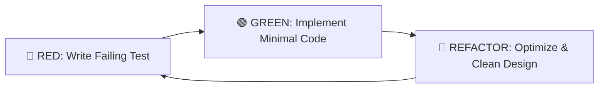
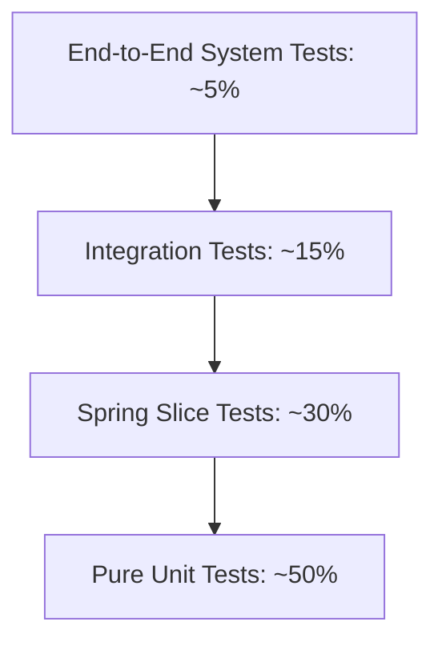

# FlowMesh Test-Driven Development (TDD) & Software Engineering Standards

This document establishes the official engineering guidelines, testing taxonomy, and Test-Driven Development (TDD) standards for the FlowMesh enterprise codebase.

---

## 1. The TDD Philosophy: Red-Green-Refactor

FlowMesh adheres strictly to Kent Beck's Test-Driven Development cycle:



1. **🔴 Red Phase**: Write an automated test describing the expected behavior before writing production code. Run the test and verify that it fails for the expected reason (not due to syntax or compilation errors).
2. **🟢 Green Phase**: Write the simplest, most direct implementation required to pass the test. Do not optimize prematurely.
3. **🔵 Refactor Phase**: Eliminate duplication, improve naming, extract clean abstractions, and optimize algorithmic complexity while keeping all tests passing.

---

## 2. FlowMesh Testing Pyramid



### 2.1 Pure Unit Tests (Base Layer)
- **Characteristics**: Sub-millisecond execution; zero network I/O; no Spring application context required.
- **Example in FlowMesh**: [DataPlatformSchemaEngineTest.java](file:///c:/Desktop/CODING%20_IS_LIFE/1%20ANTI%20GRAVITY/ENTERPISE%20WORKFLOW/services/enterprise-worker/src/test/java/io/flowmesh/enterprise/dataplatform/DataPlatformSchemaEngineTest.java) and [LockFreeTokenBucketTest.java](file:///c:/Desktop/CODING%20_IS_LIFE/1%20ANTI%20GRAVITY/ENTERPISE%20WORKFLOW/services/enterprise-worker/src/test/java/io/flowmesh/enterprise/concurrency/LockFreeTokenBucketTest.java).
- **Guidelines**: Test boundary conditions, null inputs, type coercion, and edge-case exceptions.

### 2.2 Spring Slice Tests (`@DataJpaTest`, `@WebMvcTest`)
- **Characteristics**: Fast, lightweight Spring contexts loading only the target tier.
- **Why `@DataJpaTest`**:
  - Automatically loads JPA repositories, entities, and `TestEntityManager`.
  - Configures an in-memory SQL database (H2) mimicking PostgreSQL dialect.
  - Wraps each test in a transaction that rolls back automatically upon completion.
- **Example in FlowMesh**: [EnterpriseTransactionOrmTest.java](file:///c:/Desktop/CODING%20_IS_LIFE/1%20ANTI%20GRAVITY/ENTERPISE%20WORKFLOW/services/enterprise-worker/src/test/java/io/flowmesh/enterprise/orm/EnterpriseTransactionOrmTest.java).

### 2.3 Integration Tests
- **Characteristics**: Verifies cross-component communication (e.g., embedded Apache Artemis JMS messaging, Redis caching).
- **Example in FlowMesh**: [MessagingServiceTest.java](file:///c:/Desktop/CODING%20_IS_LIFE/1%20ANTI%20GRAVITY/ENTERPISE%20WORKFLOW/services/enterprise-worker/src/test/java/io/flowmesh/enterprise/messaging/MessagingServiceTest.java).

---

## 3. Test Doubles & Mocking Standards

To maintain realistic tests without fragile mock maintenance, FlowMesh follows standard Test Double classifications:

| Double Type | Definition | FlowMesh Usage Policy |
|:---|:---|:---|
| **Dummy** | Passed to satisfy method signatures; never accessed. | Use for placeholder parameters in constructors. |
| **Stub** | Returns canned, pre-programmed responses to method calls. | Use for external REST or third-party SDK calls. |
| **Spy** | Wraps a real object to record invocations and arguments. | Use sparingly when verifying audit callbacks. |
| **Mock** | Object configured with behavioral expectations (Mockito). | Use at system boundaries (e.g. external network APIs). **Never mock JPA Repositories in persistence tests**. |
| **Fake** | Working implementation with simplified mechanics. | Preferred: Embedded H2 for database, embedded Artemis for JMS, in-memory Map for Redis locks. |

---

## 4. Walkthrough of FlowMesh TDD Suites

### 4.1 Testing Optimistic Locking Collisions
```java
@Test
@DisplayName("TDD: Optimistic Locking - Should throw ObjectOptimisticLockingFailureException on concurrent stale update")
void testOptimisticLockingCollision() {
    EnterpriseTransaction saved = repository.save(txn);
    entityManager.flush();

    // Detached snapshot at version 0
    EnterpriseTransaction staleThread1 = new EnterpriseTransaction(...);
    staleThread1.setId(saved.getId());
    staleThread1.setVersion(0L);

    // Concurrent thread updates and increments version to 1 in DB
    EnterpriseTransaction txnThread2 = repository.findById(saved.getId()).orElseThrow();
    txnThread2.setStatus("COMMITTED");
    repository.save(txnThread2);
    entityManager.flush();
    entityManager.clear();

    // Stale entity update must be rejected
    staleThread1.setStatus("REJECTED");
    assertThrows(ObjectOptimisticLockingFailureException.class, () -> {
        repository.save(staleThread1);
        entityManager.flush();
    });
}
```

### 4.2 Testing $N+1$ Query Elimination via Entity Graph
```java
@Test
@DisplayName("TDD: N+1 Query Elimination - EntityGraph should eagerly load child audit entries in single query")
void testEntityGraphEagerLoading() {
    EnterpriseTransaction saved = repository.save(txn);
    entityManager.flush();
    entityManager.clear(); // Detach all entities from session

    // Fetch via @EntityGraph
    EnterpriseTransaction loaded = repository.findByIdWithAuditEntries(saved.getId()).orElseThrow();
    
    // Verifies auditEntries are already populated in memory without triggering additional queries
    assertEquals(3, loaded.getAuditEntries().size());
}
```

---

## 5. CI/CD Quality Gates & SonarQube Standards

FlowMesh mandates automated verification via Maven and SonarQube in the CI/CD pipeline:

1. **Build & Test Verification**:
   ```powershell
   mvn clean test
   ```
2. **Jacoco Code Coverage**:
   - Minimum branch coverage: $\ge 80\%$.
   - Minimum instruction coverage: $\ge 80\%$.
   - Report generated at `target/site/jacoco/index.html`.
3. **SonarQube Quality Gate Criteria**:
   - Bugs: 0
   - Vulnerabilities: 0
   - Security Hotspots: 100% reviewed
   - Technical Debt Ratio: $< 5\%$
   - Code Duplication: $< 3\%$
