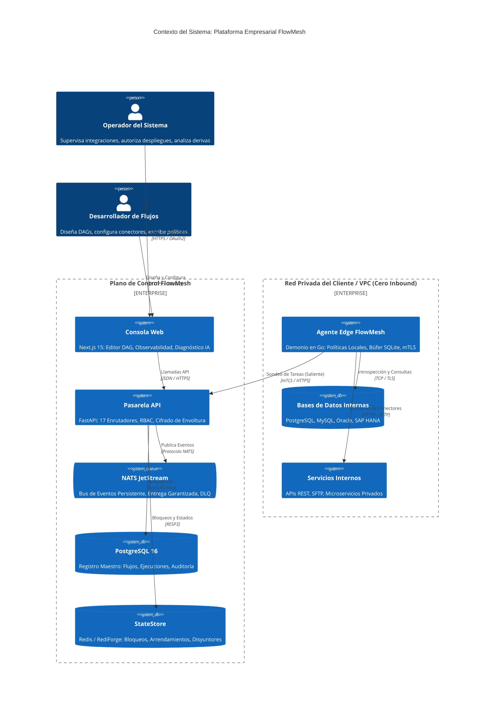
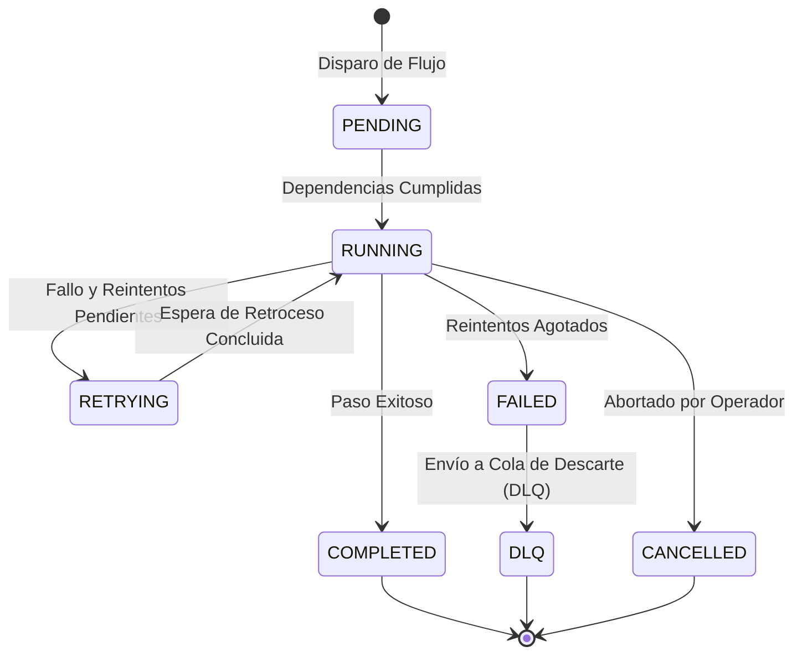

# FlowMesh — Especificación de Arquitectura y Diseño del Sistema

<p align="center">
  
  
  
</p>

<p align="center">
  <b> Idioma / Language / 语言 / 言語 / भाषा / Langue / 언어:</b><br>
  <a href="../../ARCHITECTURE.md">English</a> •
  <a href="./ARCHITECTURE.ja.md">日本語</a> •
  <a href="./ARCHITECTURE.zh.md">简体中文</a> •
  <a href="./ARCHITECTURE.hi.md">हिन्दी</a> •
  <a href="./ARCHITECTURE.fr.md">Français</a> •
  <a href="./ARCHITECTURE.ko.md">한국어</a> •
  <b>Español</b>
</p>

---

## Tabla de Contenidos

- [1. Resumen Ejecutivo de la Arquitectura](#1-resumen-ejecutivo-de-la-arquitectura)
- [2. Principios y Compromisos Arquitectónicos](#2-principios-y-compromisos-arquitectónicos)
- [3. Contexto del Sistema y Topología C4](#3-contexto-del-sistema-y-topología-c4)
- [4. Arquitectura del Plano de Control (FastAPI & Python 3.12+)](#4-arquitectura-del-plano-de-control-fastapi--python-312)
  - [4.1 Descomposición Modular en 17 Enrutadores](#41-descomposición-modular-en-17-enrutadores)
  - [4.2 El Patrón de Aislamiento `TenantScopedRepository<T>`](#42-el-patrón-de-aislamiento-tenantscopedrepositoryt)
  - [4.3 Persistencia Asíncrona con SQLAlchemy 2.0](#43-persistencia-asíncrona-con-sqlalchemy-20)
- [5. Plano de Datos y Motor de Flujos de Trabajo Distribuidos](#5-plano-de-datos-y-motor-de-flujos-de-trabajo-distribuidos)
  - [5.1 Modelado DAG y Resolución Topológica de Dependencias](#51-modelado-dag-y-resolución-topológica-de-dependencias)
  - [5.2 Ciclo de Vida de la Máquina de Estados](#52-ciclo-de-vida-de-la-máquina-de-estados)
  - [5.3 Reintentos con Retroceso Exponencial y Colas DLQ](#53-reintentos-con-retroceso-exponencial-y-colas-dlq)
- [6. Plano de Ejecución Edge (Demonio Estático en Go)](#6-plano-de-ejecución-edge-demonio-estático-en-go)
  - [6.1 Protocolo de Sondeo Exclusivamente Saliente mTLS (ADR-0001)](#61-protocolo-de-sondeo-exclusivamente-saliente-mtls-adr-0001)
  - [6.2 Firmas Criptográficas y Rechazo Total de RCE (ADR-0002)](#62-firmas-criptográficas-y-rechazo-total-de-rce-adr-0002)
  - [6.3 Búfer Local Desconectado SQLite](#63-búfer-local-desconectado-sqlite)
- [7. Troncal de Mensajería y Eventos (NATS JetStream)](#7-troncal-de-mensajería-y-eventos-nats-jetstream)
- [8. Abstracción StateStore y Consenso Distribuido (ADR-0003)](#8-abstracción-statestore-y-consenso-distribuido-adr-0003)
- [9. Arquitectura de Seguridad y Mitigación de Riesgos](#9-arquitectura-de-seguridad-y-mitigación-de-riesgos)
  - [9.1 Jerarquía de Claves de Cifrado de Envoltura (AES-256-GCM)](#91-jerarquía-de-claves-de-cifrado-de-envoltura-aes-256-gcm)
  - [9.2 Control de Acceso Basado en Roles (RBAC)](#92-control-de-acceso-basado-en-roles-rbac)
  - [9.3 Registro de Auditoría Inmutable con Encadenamiento Criptográfico](#93-registro-de-auditoría-inmutable-con-encadenamiento-criptográfico)
- [10. Motor de Descubrimiento de Esquemas y Análisis de Deriva](#10-motor-de-descubrimiento-de-esquemas-y-análisis-de-deriva)
- [11. Observabilidad Distribuida y Telemetría Unificada](#11-observabilidad-distribuida-y-telemetría-unificada)
- [12. Recuperación ante Desastres (DR) y Tolerancia a Particiones](#12-recuperación-ante-desastres-dr-y-tolerancia-a-particiones)
- [13. Matriz de Registros de Decisiones de Arquitectura (ADRs)](#13-matriz-de-registros-de-decisiones-de-arquitectura-adrs)

---

## 1. Resumen Ejecutivo de la Arquitectura

**FlowMesh** es una plataforma de integración empresarial distribuida y orientada a eventos, diseñada para coordinar flujos de trabajo críticos a través de infraestructuras híbridas y heterogéneas: bases de datos corporativas, ERPs (SAP, Oracle), microservicios internos y APIs SaaS externas.

A diferencia de las soluciones iPaaS en la nube pública, FlowMesh está diseñada bajo los principios de **confianza cero (Zero-Trust) y soberanía absoluta de datos**, operando dentro de los límites de red corporativos sin requerir la apertura de puertos entrantes en los cortafuegos.

---

## 2. Principios y Compromisos Arquitectónicos

1. **Cero Puertos Entrantes**: El plano de control nunca inicia conexiones hacia la red privada del cliente. Los agentes Edge inician túneles mTLS exclusivamente salientes.
2. **Ejecución Determinista y Reproducible**: Los flujos de trabajo se modelan como grafos acíclicos dirigidos (DAG) inmutables. Cada cambio de estado emite un evento persistente que garantiza la reproducción exacta tras un fallo.
3. **Defensa en Profundidad y Verificación Criptográfica**: Cada instrucción enviada a los agentes Edge debe estar firmada con claves Ed25519 y validada por políticas declarativas locales.
4. **Motor de Estado Desacoplado**: La gestión de bloqueos, arrendamientos y disyuntores está unificada bajo la interfaz `StateStore`, soportando Redis, RediForge y memoria local.
5. **Aislamiento Multitenant Estricto**: El patrón `TenantScopedRepository` impone el filtrado por `tenant_id` en el acceso a datos, erradicando fugas de información.
6. **Plano de Control sin Estado (Stateless)**: Las instancias de la API no mantienen estado local efímero, permitiendo escalabilidad horizontal inmediata.
7. **Trazabilidad Integral de Extremo a Extremo**: El contexto W3C TraceContext se propaga a través de peticiones HTTP, colas NATS y agentes Edge.
8. **Degradación Elegante ante Cortes**: En caso de fallo WAN, el agente Edge almacena los resultados en un búfer SQLite local y los envía automáticamente al reconectar.

---

## 3. Contexto del Sistema y Topología C4



---

## 4. Arquitectura del Plano de Control (FastAPI & Python 3.12+)

### 4.1 Descomposición Modular en 17 Enrutadores
La pasarela API distribuye sus responsabilidades en `apps/api/app/routers/`:
- `workflows`: Gestión del ciclo de vida de flujos, validación DAG y compilación inmutable.
- `runs`: Disparadores de ejecución, reejecución de pasos y cancelaciones de emergencia.
- `agents`: Inscripción, rotación de credenciales, latidos de vida y asignación de tareas.
- `connections`: Credenciales seguras, cifrado de envoltura y pruebas de conectividad.
- `drift`: Detección de metadatos de esquemas, fijación de línea base y cálculo de derivas.
- `policies`: Motor de políticas de seguridad previas al despliegue.
- `incidents`: Agrupación de incidencias y análisis de causa raíz con asistente de IA.
- `state`: Telemetría en tiempo real de bloqueos distribuidos y disyuntores.
- `audit`: Consulta segura de pistas de auditoría inmutables.
- `observability`: Búsqueda de trazas distribuidas y métricas de latencia.

### 4.2 El Patrón de Aislamiento `TenantScopedRepository<T>`
```python
class TenantScopedRepository(Generic[T]):
    def __init__(self, session: AsyncSession, tenant_id: str):
        self._session = session
        self._tenant_id = tenant_id

    async def get_by_id(self, entity_id: str) -> Optional[T]:
        stmt = (
            select(self._model)
            .where(self._model.id == entity_id)
            .where(self._model.tenant_id == self._tenant_id)
        )
        result = await self._session.execute(stmt)
        return result.scalar_one_or_none()
```

---

## 5. Plano de Datos y Motor de Flujos de Trabajo Distribuidos

### 5.1 Modelado DAG y Resolución Topológica de Dependencias
- Determinación topológica estricta de orden de ejecución.
- Disparo concurrente de pasos sin dependencias insatisfechas.
- Bifurcaciones condicionales avanzadas (`switch`, `parallel`, `join`).

### 5.2 Ciclo de Vida de la Máquina de Estados



---

## 6. Plano de Ejecución Edge (Demonio Estático en Go)

- **Conexión Exclusivamente Saliente ([ADR-0001](docs/adr/ADR-0001-agent-outbound-only.md))**: Sin apertura de puertos entrantes en el cortafuegos mediante túneles mTLS.
- **Rechazo Total de RCE ([ADR-0002](docs/adr/ADR-0002-no-remote-code-execution.md))**: Prohibición de scripts de consola; ejecución exclusiva de conectores declarativos verificados mediante firmas Ed25519.
- **Búfer Local SQLite**: Almacena resultados durante cortes de conexión WAN y los retransmite de forma ordenada al recuperar la red.

---

## 7. Troncal de Mensajería y Eventos (NATS JetStream)

- **Estándar CloudEvents 1.0**: Serialización JSON estandarizada para todos los eventos del sistema.
- **Deduplicación Estricta**: Uso del encabezado `Nats-Msg-Id` con hashes SHA-256 para evitar duplicaciones por reintentos de red.

---

## 8. Abstracción StateStore y Consenso Distribuido (ADR-0003)

- Interfaz única para **Redis**, **RediForge** y **Memoria**.
- Bloqueos distribuidos atómicos mediante scripts Lua.
- Disyuntores de circuito con gestión automática de estados `CLOSED`, `OPEN` y `HALF_OPEN`.

---

## 9. Arquitectura de Seguridad y Mitigación de Riesgos

- **Cifrado de Envoltura**: Clave Maestra (KEK) protegiendo las Claves de Datos (DEK); cifrado AES-256-GCM para todas las credenciales sensibles.
- **RBAC de 4 Niveles**: `owner`, `operator`, `developer`, `viewer`.
- **Auditoría Encadenada Criptográficamente**: Cada registro almacena el hash SHA-256 del evento previo para evitar cualquier alteración histórica.

---

## 10. Motor de Descubrimiento de Esquemas y Análisis de Deriva

Inspección periódica de estructuras de datos y comparación con la línea base:
- **`WARNING` (Compatible)**: Nuevas columnas opcionales.
- **`CRITICAL` (Disruptivo)**: Columnas eliminadas o tipos de datos alterados.

---

## 11. Observabilidad Distribuida y Telemetría Unificada

- **W3C TraceContext**: Trazabilidad completa desde la interfaz de usuario hasta los conectores finales.
- **Métricas Prometheus**: Métricas operativas expuestas a través del endpoint `/metrics`.

---

## 12. Recuperación ante Desastres (DR) y Tolerancia a Particiones

| Escenario de Fallo | Mecanismo de Recuperación | RTO (Tiempo de Recuperación) | RPO (Pérdida de Datos) |
| :--- | :--- | :--- | :--- |
| **Caída de Nodo API** | Conmutación por balanceador de carga sin estado | $< 3\text{ segundos}$ | $0\text{ segundos}$ (sin pérdida) |
| **Corte WAN en Agente Edge** | Búfer SQLite local persistente; retransmisión automática | Al reconectar | $0\text{ segundos}$ (asegurado) |
| **Fallo en Redis** | Reanudación desde puntos de control en PostgreSQL | Al recuperar Redis | $0\text{ segundos}$ |
| **Fallo en NATS** | Replicación JetStream basada en consenso Raft | $< 5\text{ segundos}$ | $0\text{ segundos}$ |
| **Fallo en Base de Datos**| Conmutación por error en PostgreSQL 16 replicado | $< 30\text{ segundos}$ | $< 1\text{ segundo}$ |

---

## 13. Matriz de Registros de Decisiones de Arquitectura (ADRs)

- **[ADR-0001: Arquitectura Exclusivamente Saliente para el Agente Edge](docs/adr/ADR-0001-agent-outbound-only.md)** (Aceptado)
- **[ADR-0002: Rechazo de Cualquier Ejecución Remota de Código](docs/adr/ADR-0002-no-remote-code-execution.md)** (Aceptado)
- **[ADR-0003: Abstracción StateStore Genérica para Redis y RediForge](docs/adr/ADR-0003-statestore-abstraction.md)** (Aceptado)
- **[ADR-0004: Versionado Inmutable de Flujos de Trabajo](docs/adr/ADR-0004-immutable-workflow-versions.md)** (Aceptado)
