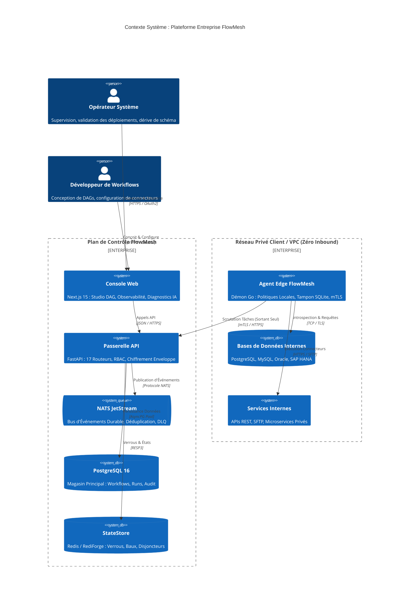
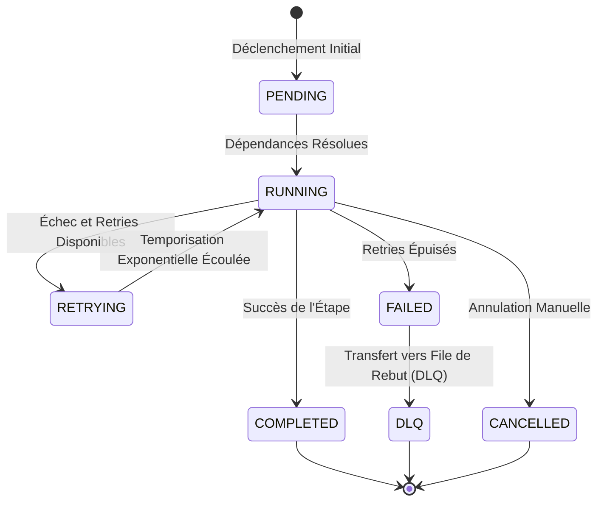

# FlowMesh — Spécification d'Architecture et de Conception Système

<p align="center">
  
  
  
</p>

<p align="center">
  <b> Langue / Language / 语言 / 言語 / भाषा / 언어 / Idioma:</b><br>
  <a href="../../ARCHITECTURE.md">English</a> •
  <a href="./ARCHITECTURE.ja.md">日本語</a> •
  <a href="./ARCHITECTURE.zh.md">简体中文</a> •
  <a href="./ARCHITECTURE.hi.md">हिन्दी</a> •
  <b>Français</b> •
  <a href="./ARCHITECTURE.ko.md">한국어</a> •
  <a href="./ARCHITECTURE.es.md">Español</a>
</p>

---

## Table des Matières

- [1. Vue d'Ensemble de l'Architecture](#1-vue-densemble-de-larchitecture)
- [2. Principes Directeurs et Engagements Techniques](#2-principes-directeurs-et-engagements-techniques)
- [3. Contexte Système et Topologie C4](#3-contexte-système-et-topologie-c4)
- [4. Architecture du Plan de Contrôle (FastAPI & Python 3.12+)](#4-architecture-du-plan-de-contrôle-fastapi--python-312)
  - [4.1 Décomposition des 17 Routeurs](#41-décomposition-des-17-routeurs)
  - [4.2 Modèle d'Isolation Multi-Tenant `TenantScopedRepository<T>`](#42-modèle-disolation-multi-tenant-tenantscopedrepositoryt)
  - [4.3 Persistance des Données avec SQLAlchemy 2.0 Asynchrone](#43-persistance-des-données-avec-sqlalchemy-20-asynchrone)
- [5. Plan de Données et Moteur de Workflows Distribués](#5-plan-de-données-et-moteur-de-workflows-distribués)
  - [5.1 Modélisation DAG et Résolution Topologique](#51-modélisation-dag-et-résolution-topologique)
  - [5.2 Cycle de Vie de la Machine à États](#52-cycle-de-vie-de-la-machine-à-états)
  - [5.3 Retries, Backoff Exponentiel et Files d'Attente de Rebut (DLQ)](#53-retries-backoff-exponentiel-et-files-dattente-de-rebut-dlq)
- [6. Plan d'Exécution Edge (Démon Statique en Go)](#6-plan-dexécution-edge-démon-statique-en-go)
  - [6.1 Protocole de Scrutation Exclusivement Sortant mTLS (ADR-0001)](#61-protocole-de-scrutation-exclusivement-sortant-mtls-adr-0001)
  - [6.2 Signature Cryptographique et Interdiction du RCE (ADR-0002)](#62-signature-cryptographique-et-interdiction-du-rce-adr-0002)
  - [6.3 Tampon Local Résilient SQLite en Cas de Coupure Réseau](#63-tampon-local-résilient-sqlite-en-cas-de-coupure-réseau)
- [7. Épine Dorsale Événementielle (NATS JetStream)](#7-épine-dorsale-événementielle-nats-jetstream)
- [8. Abstraction StateStore et Consensus Distribué (ADR-0003)](#8-abstraction-statestore-et-consensus-distribué-adr-0003)
- [9. Architecture de Sécurité et Atténuation des Risques](#9-architecture-de-sécurité-et-atténuation-des-risques)
  - [9.1 Hiérarchie des Clés de Chiffrement Enveloppe (AES-256-GCM)](#91-hiérarchie-des-clés-de-chiffrement-enveloppe-aes-256-gcm)
  - [9.2 Contrôle d'Accès Basé sur les Rôles (RBAC)](#92-contrôle-daccès-basé-sur-les-rôles-rbac)
  - [9.3 Journalisation d'Audit Immuable à Chaînage Cryptographique](#93-journalisation-daudit-immuable-à-chaînage-cryptographique)
- [10. Moteur de Découverte de Schéma et Analyse de Dérive](#10-moteur-de-découverte-de-schéma-et-analyse-de-dérive)
- [11. Observabilité Distribuée et Télémétrie Unifiée](#11-observabilité-distribuée-et-télémétrie-unifiée)
- [12. Résilience Opérationnelle et Reprise d'Activité (PRA)](#12-résilience-opérationnelle-et-reprise-dactivité-pra)
- [13. Répertoire des Décisions d'Architecture (ADRs)](#13-répertoire-des-décisions-darchitecture-adrs)

---

## 1. Vue d'Ensemble de l'Architecture

**FlowMesh** est une plateforme d'intégration et d'orchestration distribuée conçue pour interconnecter de façon fiable et sécurisée des systèmes d'information hétérogènes : bases de données sur site, ERP critiques (SAP, Oracle), microservices internes et API SaaS cloud.

Contrairement aux solutions SaaS traditionnelles, FlowMesh s'appuie sur une philosophie de **sécurité Zéro-Trust et de stricte souveraineté des données**. Elle permet d'exécuter des flux complexes au sein des réseaux privés de l'entreprise sans jamais ouvrir de ports entrants sur les pare-feu d'entreprise.

---

## 2. Principes Directeurs et Engagements Techniques

1. **Surface d'Attaque Inbound Nulle** : Aucun flux réseau n'est initié du plan de contrôle vers les réseaux clients. Les agents Edge établissent des tunnels sortants exclusifs.
2. **Exécution Déterministe et Rejouable** : Les workflows sont décrits sous forme de graphes orientés acycliques (DAG) immuables. Tout changement d'état génère un événement persistant, garantissant la reprise exacte après panne.
3. **Défense en Profondeur et Cryptographie** : Toutes les commandes exécutées sur le plan Edge sont signées au format Ed25519 et vérifiées localement par un moteur de règles d'entreprise.
4. **Moteur d'État Interchangeable** : La gestion des verrous, baux et disjoncteurs est unifiée via l'interface `StateStore`, supportant Redis, RediForge et un moteur mémoire.
5. **Isolation Multi-Tenant Native** : L'accès aux données est systématiquement conditionné par le modèle `TenantScopedRepository`, éliminant tout risque de fuite de données inter-entreprises.
6. **Plan de Contrôle Sans État (Stateless)** : Les instances API ne stockent aucun état local temporaire, permettant une scalabilité horizontale immédiate.
7. **Traçabilité Distribuée Totale** : Le contexte W3C TraceContext se propage à travers les requêtes HTTP, les flux NATS et les agents Edge.
8. **Résilience en Mode Déconnecté** : En cas de rupture WAN, l'agent Edge stocke ses événements dans une base SQLite locale et les rejoue à la reconnexion.

---

## 3. Contexte Système et Topologie C4



---

## 4. Architecture du Plan de Contrôle (FastAPI & Python 3.12+)

### 4.1 Décomposition des 17 Routeurs
La passerelle API décompose ses responsabilités dans `apps/api/app/routers/` :
- `workflows` : Gestion du cycle de vie des définitions de workflows, compilation de DAGs.
- `runs` : Déclenchements, rejeux d'étapes, arrêts d'urgence.
- `agents` : Enrôlement, rotation des certificats, battements de cœur et dispatching.
- `connections` : Identifiants sécurisés, chiffrement enveloppe, validation de connectivité.
- `drift` : Introspection de métadonnées, fixation de référence et calcul de dérive.
- `policies` : Moteur de politiques de gouvernance préalables à la production.
- `incidents` : Analyse causale assistée par IA et consolidation des pannes.
- `state` : Télémétrie en temps réel des verrous distribués et des disjoncteurs.
- `audit` : Consultation sécurisée des journaux d'audit chaînés.
- `observability` : Recherche de traces distribuées et métriques de latence.

### 4.2 Modèle d'Isolation Multi-Tenant `TenantScopedRepository<T>`
```python
class TenantScopedRepository(Generic[T]):
    def __init__(self, session: AsyncSession, tenant_id: str):
        self._session = session
        self._tenant_id = tenant_id

    async def get_by_id(self, entity_id: str) -> Optional[T]:
        stmt = (
            select(self._model)
            .where(self._model.id == entity_id)
            .where(self._model.tenant_id == self._tenant_id)
        )
        result = await self._session.execute(stmt)
        return result.scalar_one_or_none()
```

---

## 5. Plan de Données et Moteur de Workflows Distribués

### 5.1 Modélisation DAG et Résolution Topologique
- Exécution ordonnée par tri topologique déterministe.
- Déclenchement simultané des étapes indépendantes.
- Support natif des branches conditionnelles (`switch`, `parallel`, `join`).

### 5.2 Cycle de Vie de la Machine à États



---

## 6. Plan d'Exécution Edge (Démon Statique en Go)

- **Modèle Réseau Sortant Pur ([ADR-0001](docs/adr/ADR-0001-agent-outbound-only.md))** : Aucun port exposé sur le réseau de l'entreprise ; interrogation par boucle mTLS sortante.
- **Interdiction du RCE Arbitraire ([ADR-0002](docs/adr/ADR-0002-no-remote-code-execution.md))** : Aucun script shell ; seules les opérations déclaratives et typées avec signature Ed25519 sont exécutées.
- **Mise en Tampon Locale SQLite** : Sauvegarde des métriques et résultats en base locale lors des pannes WAN et renvoi ordonné après rétablissement.

---

## 7. Épine Dorsale Événementielle (NATS JetStream)

- **Standard CloudEvents 1.0** : Sérialisation universelle des événements.
- **Déduplication Native** : Calcul d'empreinte SHA-256 transmis via l'en-tête `Nats-Msg-Id` pour interdire les doubles exécutions.

---

## 8. Abstraction StateStore et Consensus Distribué (ADR-0003)

- Interface commune couvrant **Redis**, **RediForge** et **In-Memory**.
- Verrous distribués atomiques par scripts Lua.
- Disjoncteurs matériels gérant automatiquement les états `CLOSED`, `OPEN` et `HALF_OPEN`.

---

## 9. Architecture de Sécurité et Atténuation des Risques

- **Chiffrement Enveloppe** : Clé Maîtresse (KEK) protégeant les Clés de Données (DEK) ; chiffrement AES-256-GCM sans écriture de mot de passe en clair.
- **Matrice RBAC à 4 Niveaux** : `owner`, `operator`, `developer`, `viewer`.
- **Intégrité d'Audit par Hachage Chaîné** : Chaque entrée d'audit scelle l'empreinte SHA-256 de la précédente.

---

## 10. Moteur de Découverte de Schéma et Analyse de Dérive

Comparaison systématique entre l'état actuel des bases clientes et l'empreinte de référence validée :
- **`WARNING` (Non Bloquant)** : Ajout de colonnes optionnelles.
- **`CRITICAL` (Rupture)** : Suppression de colonnes ou modification incompatible de type de données.

---

## 11. Observabilité Distribuée et Télémétrie Unifiée

- **Traçage W3C** : Identifiant de trace partagé de l'interface graphique jusqu'aux requêtes de bases de données finales.
- **Métriques Prometheus** : Métriques standardisées publiées sur `/metrics`.

---

## 12. Résilience Opérationnelle et Reprise d'Activité (PRA)

| Scénario de Panne | Mécanisme de Résilience | RTO (Temps de Reprise) | RPO (Perte de Données) |
| :--- | :--- | :--- | :--- |
| **Crash d'un Nœud API** | Bascule automatique via répartiteur de charge | $< 3\text{ secondes}$ | $0\text{ seconde}$ (aucune perte) |
| **Coupure WAN de l'Agent Edge** | Stockage sur base SQLite locale ; renvoi automatique | À la reconnexion | $0\text{ seconde}$ (sécurisé) |
| **Panne de Redis** | Reprise sur les points de contrôle durcis dans PostgreSQL | Au redémarrage | $0\text{ seconde}$ |
| **Panne de NATS** | Réplication JetStream sur consensus Raft | $< 5\text{ secondes}$ | $0\text{ seconde}$ |
| **Panne Base de Données** | Basculement automatique PostgreSQL 16 répliqué | $< 30\text{ secondes}$ | $< 1\text{ seconde}$ |

---

## 13. Répertoire des Décisions d'Architecture (ADRs)

- **[ADR-0001 : Architecture Exclusivement Sortante de l'Agent Edge](docs/adr/ADR-0001-agent-outbound-only.md)** (Accepté)
- **[ADR-0002 : Rejet de Toute Exécution de Code Distant Arbitraire](docs/adr/ADR-0002-no-remote-code-execution.md)** (Accepté)
- **[ADR-0003 : Abstraction StateStore Générique pour Redis & RediForge](docs/adr/ADR-0003-statestore-abstraction.md)** (Accepté)
- **[ADR-0004 : Immuabilité et Épinglage des Versions de Workflows](docs/adr/ADR-0004-immutable-workflow-versions.md)** (Accepté)
