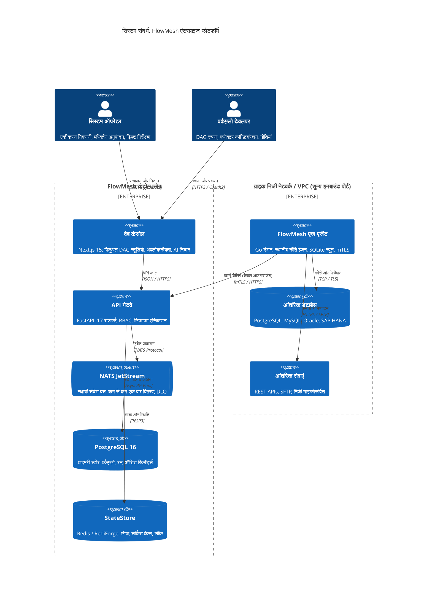
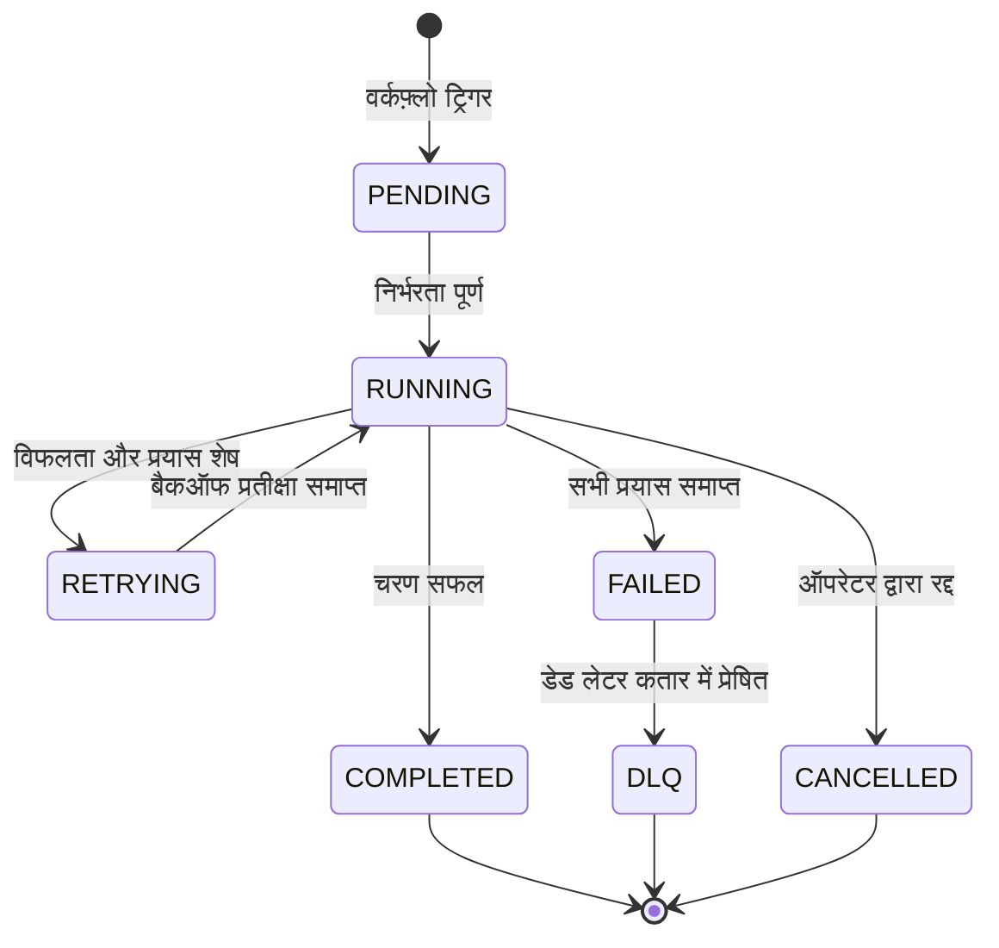

# FlowMesh — सिस्टम वास्तुकला एवं तकनीकी विनिर्देश (Architecture & Design Specification)

<p align="center">
  
  
  
</p>

<p align="center">
  <b> भाषा / Language / 语言 / 言語 / Langue / 언어 / Idioma:</b><br>
  <a href="../../ARCHITECTURE.md">English</a> •
  <a href="./ARCHITECTURE.ja.md">日本語</a> •
  <a href="./ARCHITECTURE.zh.md">简体中文</a> •
  <b>हिन्दी</b> •
  <a href="./ARCHITECTURE.fr.md">Français</a> •
  <a href="./ARCHITECTURE.ko.md">한국어</a> •
  <a href="./ARCHITECTURE.es.md">Español</a>
</p>

---

## विषय सूची

- [1. कार्यकारी वास्तुकला अवलोकन](#1-कार्यकारी-वास्तुकला-अवलोकन)
- [2. मार्गदर्शक सिद्धांत एवं सिद्धांत](#2-मार्गदर्शक-सिद्धांत-एवं-सिद्धांत)
- [3. सिस्टम संदर्भ एवं C4 मॉडल टोपोलॉजी](#3-सिस्टम-संदर्भ-एवं-c4-मॉडल-टोपोलॉजी)
- [4. कंट्रोल प्लेन वास्तुकला (FastAPI & Python 3.12+)](#4-कंट्रोल-प्लेन-वास्तुकला-fastapi--python-312)
  - [4.1 डोमेन राउटर अपघटन](#41-डोमेन-राउटर-अपघटन)
  - [4.2 `TenantScopedRepository<T>` मल्टी-टेनेंट अलगाव पैटर्न](#42-tenantscopedrepositoryt-मल्टी-टेनेंट-अलगाव-पैटर्न)
  - [4.3 एसिंक्रोनस SQLAlchemy 2.0 दृढ़ता](#43-एसिंक्रोनस-sqlalchemy-20-दृढ़ता)
- [5. डेटा प्लेन और वितरित वर्कफ़्लो इंजन](#5-डेटा-प्लेन-और-वितरित-वर्कफ़्लो-इंजन)
  - [5.1 DAG संरचना और निर्भरता समाधान](#51-dag-संरचना-और-निर्भरता-समाधान)
  - [5.2 स्टेट मशीन जीवन चक्र](#52-स्टेट-मशीन-जीवन-चक्र)
  - [5.3 घातीय बैकऑफ और डेड लेटर कतार (DLQ)](#53-घातीय-बैकऑफ-और-डेड-लेटर-कतार-dlq)
- [6. एज निष्पादन प्लेन (Go स्टैटिक डेमन)](#6-एज-निष्पादन-प्लेन-go-स्टैटिक-डेमन)
  - [6.1 केवल-आउटबाउंड mTLS पोलिंग प्रोटोकॉल (ADR-0001)](#61-केवल-आउटबाउंड-mtls-पोलिंग-प्रोटोकॉल-adr-0001)
  - [6.2 क्रिप्टोग्राफ़िक हस्ताक्षर और RCE का निषेध (ADR-0002)](#62-क्रिप्टोग्राफ़िक-हस्ताक्षर-और-rce-का-निषेध-adr-0002)
  - [6.3 एम्बेडेड SQLite ऑफ़लाइन स्पूल बफ़र](#63-एम्बेडेड-sqlite-ऑफ़लाइन-स्पूल-बफ़र)
- [7. मैसेजिंग रीढ़ (NATS JetStream)](#7-मैसेजिंग-रीढ़-nats-jetstream)
- [8. StateStore अमूर्तता और वितरित सहमति (ADR-0003)](#8-statestore-अमूर्तता-और-वितरित-सहमति-adr-0003)
- [9. सुरक्षा वास्तुकला और जोखिम शमन](#9-सुरक्षा-वास्तुकला-और-जोखिम-शमन)
  - [9.1 लिफाफा एन्क्रिप्शन पदानुक्रम (AES-256-GCM)](#91-लिफाफा-एन्क्रिप्शन-पदानुक्रम-aes-256-gcm)
  - [9.2 रोल-बेस्ड एक्सेस कंट्रोल (RBAC)](#92-रोल-बेस्ड-एक्सेस-कंट्रोल-rbac)
  - [9.3 केवल-जोड़ने योग्य ऑडिट लॉग एवं अखंडता](#93-केवल-जोड़ने-योग्य-ऑडिट-लॉग-एवं-अखंडता)
- [10. स्कीमा खोज एवं ड्रिफ्ट डिटेक्शन इंजन](#10-स्कीमा-खोज-एवं-ड्रिफ्ट-डिटेक्शन-इंजन)
- [11. वितरित अवलोकनीयता और टेलीमेट्री](#11-वितरित-अवलोकनीयता-और-टेलीमेट्री)
- [12. आपदा वसूली (DR) और नेटवर्क विभाजन लचीलापन](#12-आपदा-वसूली-dr-और-नेटवर्क-विभाजन-लचीलापन)
- [13. आर्किटेक्चर डिसीजन रिकॉर्ड्स (ADR) सूचकांक](#13-आर्किटेक्चर-डिसीजन-रिकॉर्ड्स-adr-सूचकांक)

---

## 1. कार्यकारी वास्तुकला अवलोकन

**FlowMesh** एक वितरित, इवेंट-चालित एंटरप्राइज़ एकीकरण प्लेटफ़ॉर्म है जिसे ऑन-प्रेमिस रिलेशनल डेटाबेस, कोर ईआरपी सूट (SAP, Oracle), आंतरिक निजी सेवाओं और क्लाउड SaaS API के बीच जटिल व्यावसायिक वर्कफ़्लो को ऑर्केस्ट्रेट करने के लिए बनाया गया है।

पारंपरिक क्लाउड iPaaS के विपरीत, FlowMesh **शून्य-विश्वास (Zero-Trust) नेटवर्क सीमाओं और डेटा संप्रभुता** को केंद्र में रखकर बनाया गया है। यह ग्राहक के कॉर्पोरेट फ़ायरवॉल पर बिना किसी इनबाउंड पोर्ट को खोले सुरक्षित संचालन सुनिश्चित करता है।

---

## 2. मार्गदर्शक सिद्धांत एवं सिद्धांत

1. **शून्य इनबाउंड पोर्ट्स**: कंट्रोल प्लेन कभी भी ग्राहक के आंतरिक नेटवर्क में कनेक्शन आरंभ नहीं करता। केवल ग्राहक वीपीसी से आउटबाउंड टीएलएस टनल का उपयोग होता है।
2. **सटीक एवं प्रतिलिपि योग्य निष्पादन**: सभी वर्कफ़्लो अपरिवर्तनीय DAG के रूप में संरचित हैं। प्रत्येक चरण एक स्थिति घटना उत्पन्न करता है जिससे विफलता के बिंदु से पुनः आरंभ संभव होता है।
3. **गहन सुरक्षा एवं क्रिप्टोग्राफ़िक सत्यापन**: एज एजेंट पर निष्पादित होने वाले सभी आदेश Ed25519 निजी कुंजी द्वारा हस्ताक्षरित होते हैं।
4. **पृथक स्टेट स्टोर**: स्थिति प्रबंधन को एक मानक इंटरफ़ेस के पीछे अलग रखा गया है, जो Redis, RediForge और इन-मेमोरी को समर्थन देता है।
5. **मल्टी-टेनेंसी का कड़ा अलगाव**: `TenantScopedRepository` पैटर्न द्वारा डेटाबेस स्तर पर टेनेंट डेटा के मिश्रण को पूरी तरह से रोका जाता है।
6. **स्टेटलेस कंट्रोल प्लेन**: एपीआई गेटवे उदाहरण किसी भी स्थानीय स्थिति को संग्रहीत नहीं करते हैं, जिससे सहज क्षैतिज ऑटो-स्केलिंग संभव होती है।
7. **पूर्ण ट्रेसिंग अवलोकनीयता**: W3C ट्रेस कॉन्टेक्स्ट HTTP से लेकर NATS मैसेज ब्रोकर और एज एजेंट तक निरंतर प्रवाहित होता है।
8. **शानदार गिरावट (Graceful Degradation)**: WAN नेटवर्क विफलता के दौरान एज एजेंट स्थानीय SQLite स्पूल में परिणाम सुरक्षित रखते हैं।

---

## 3. सिस्टम संदर्भ एवं C4 मॉडल टोपोलॉजी



---

## 4. कंट्रोल प्लेन वास्तुकला (FastAPI & Python 3.12+)

### 4.1 डोमेन राउटर अपघटन
`apps/api/app/routers/` में 17 विशेष डोमेन राउटर्स संरचित हैं:
- `workflows`: वर्कफ़्लो परिभाषा प्रबंधन, DAG संकलन।
- `runs`: निष्पादन प्रारंभ, पुनः प्रयास, स्थिति ट्रैकिंग।
- `agents`: एजेंट नामांकन, टोकन प्रबंधन, हार्टबीट और टास्क वितरण।
- `connections`: कनेक्शन क्रेडेंशियल्स, लिफाफा एन्क्रिप्शन, कनेक्टिविटी टेस्ट।
- `drift`: स्कीमा मेटाडेटा खोज, आधारभूत लॉकिंग, ड्रिफ्ट गणना।
- `policies`: सुरक्षा नीति इंजन और प्री-डिप्लॉयमेंट सत्यापन।
- `incidents`: घटना सहसंबंध और AI रूट कॉज विश्लेषण।
- `state`: वितरित लॉक और सर्किट ब्रेकर टेलीमेट्री।
- `audit`: अपरिवर्तनीय ऑडिट लॉग क्वेरी।
- `observability`: लाइव वितरित ट्रेस और लेटेंसी मेट्रिक्स।

### 4.2 `TenantScopedRepository<T>` मल्टी-टेनेंट अलगाव पैटर्न
प्रत्येक डेटाबेस ऑपरेशन पर टेनेंट सुरक्षा अनिवार्य की गई है:

```python
class TenantScopedRepository(Generic[T]):
    def __init__(self, session: AsyncSession, tenant_id: str):
        self._session = session
        self._tenant_id = tenant_id

    async def get_by_id(self, entity_id: str) -> Optional[T]:
        stmt = (
            select(self._model)
            .where(self._model.id == entity_id)
            .where(self._model.tenant_id == self._tenant_id)
        )
        result = await self._session.execute(stmt)
        return result.scalar_one_or_none()
```

---

## 5. डेटा प्लेन और वितरित वर्कफ़्लो इंजन

### 5.1 DAG संरचना और निर्भरता समाधान
- टोपोलॉजिकल सॉर्टिंग द्वारा निर्भरताओं का पूर्व-संकलन।
- समानांतर निष्पादन शाखाएं (`parallel`, `switch`, `join`)।

### 5.2 स्टेट मशीन जीवन चक्र



---

## 6. एज निष्पादन प्लेन (Go स्टैटिक डेमन)

- **केवल-आउटबाउंड नेटवर्क मॉडल ([ADR-0001](docs/adr/ADR-0001-agent-outbound-only.md))**: ग्राहक के फ़ायरवॉल पर कोई पोर्ट खोले बिना सुरक्षित mTLS कनेक्शन।
- **RCE का पूर्ण बहिष्कार ([ADR-0002](docs/adr/ADR-0002-no-remote-code-execution.md))**: मनमानी शैल स्क्रिप्ट निष्पादन निषिद्ध है; केवल प्रमाणित कनेक्टर्स की अनुमति है।
- **स्थानीय SQLite बफ़र**: इंटरनेट डिस्कनेक्ट होने पर भी स्थानीय डेटा सुरक्षित रहता है।

---

## 7. मैसेजिंग रीढ़ (NATS JetStream)

- **CloudEvents 1.0 मानक**: मानकीकृत JSON इवेंट पेवलोड।
- **डुप्लीकेशन रोकथाम**: `Nats-Msg-Id` हेडर में SHA-256 हैश द्वारा नेटवर्क रिट्राई के दौरान दोहराव से बचाव।

---

## 8. StateStore अमूर्तता और वितरित सहमति (ADR-0003)

- **एकीकृत इंटरफ़ेस**: Redis, RediForge और In-Memory बैकएंड।
- **रेडलॉक वितरित लॉक**: Lua स्क्रिप्ट द्वारा परमाणु लॉक रिलीज और लीज विस्तार।
- **सर्किट ब्रेकर**: विफलता दरों के आधार पर `CLOSED`, `OPEN`, `HALF_OPEN` स्थिति प्रवाह।

---

## 9. सुरक्षा वास्तुकला और जोखिम शमन

- **लिफाफा एन्क्रिप्शन (Envelope Encryption)**: मास्टर कुंजी (KEK) द्वारा टेनेंट कुंजी (DEK) का प्रबंधन; AES-256-GCM द्वारा क्रेडेंशियल्स का सुरक्षित एन्क्रिप्शन।
- **चार-स्तरीय RBAC**: `owner`, `operator`, `developer`, `viewer`।
- **क्रिप्टोग्राफ़िक ऑडिटिंग**: पिछले ब्लॉक के SHA-256 हैश से जुड़े लॉग, जिससे छेड़छाड़ असंभव हो जाती है।

---

## 10. स्कीमा खोज एवं ड्रिफ्ट डिटेक्शन इंजन

- नियमित मेटाडेटा स्कैन।
- बेसलाइन स्नैपशॉट के साथ तुलना:
  - **`WARNING`**: वैकल्पिक कॉलम जोड़ना।
  - **`CRITICAL`**: कॉलम हटाना या डेटा प्रकार बदलना।

---

## 11. वितरित अवलोकनीयता और टेलीमेट्री

- **W3C TraceContext**: HTTP अनुरोध से लेकर NATS और एज कनेक्टर तक एक ही ट्रेस आईडी।
- **Prometheus मेट्रिक्स**: `/metrics` एंडपॉइंट पर विस्तृत निगरानी मेट्रिक्स उपलब्ध।

---

## 12. आपदा वसूली (DR) और नेटवर्क विभाजन लचीलापन

| विफलता परिदृश्य | समाधान तंत्र | RTO (पुनर्प्राप्ति समय) | RPO (डेटा नुकसान) |
| :--- | :--- | :--- | :--- |
| **API नोड क्रैश** | लोड बैलेंसर द्वारा स्वचालित स्टेटलेस फ़ेलओवर | $< 3\text{ सेकंड}$ | $0\text{ सेकंड}$ (शून्य हानि) |
| **एज एजेंट इंटरनेट विफलता** | स्थानीय SQLite बफ़र में डेटा सुरक्षित; स्वतः पुनः प्रयास | कनेक्शन वापसी पर | $0\text{ सेकंड}$ (पूर्ण सुरक्षित) |
| **Redis विफलता** | PostgreSQL में सहेजे गए चेकपॉइंट से पुनः प्रारंभ | Redis बहाली पर | $0\text{ सेकंड}$ |
| **NATS विफलता** | JetStream Raft क्लस्टरिंग द्वारा संदेश पुनः प्राप्ति | $< 5\text{ सेकंड}$ | $0\text{ सेकंड}$ |
| **डेटाबेस विफलता** | PostgreSQL 16 प्रतिकृति द्वारा त्वरित फ़ेलओवर | $< 30\text{ सेकंड}$ | $< 1\text{ सेकंड}$ |

---

## 13. आर्किटेक्चर डिसीजन रिकॉर्ड्स (ADR) सूचकांक

- **[ADR-0001: एज एजेंट हेतु आउटबाउंड-ओनली आर्किटेक्चर](docs/adr/ADR-0001-agent-outbound-only.md)** (स्वीकृत)
- **[ADR-0002: रिमोट कोड एक्जीक्यूशन का पूर्ण निषेध](docs/adr/ADR-0002-no-remote-code-execution.md)** (स्वीकृत)
- **[ADR-0003: Redis एवं RediForge स्टेटस्टोर अमूर्तता](docs/adr/ADR-0003-statestore-abstraction.md)** (स्वीकृत)
- **[ADR-0004: अपरिवर्तनीय वर्कफ़्लो संस्करण एवं पिनिंग](docs/adr/ADR-0004-immutable-workflow-versions.md)** (स्वीकृत)
