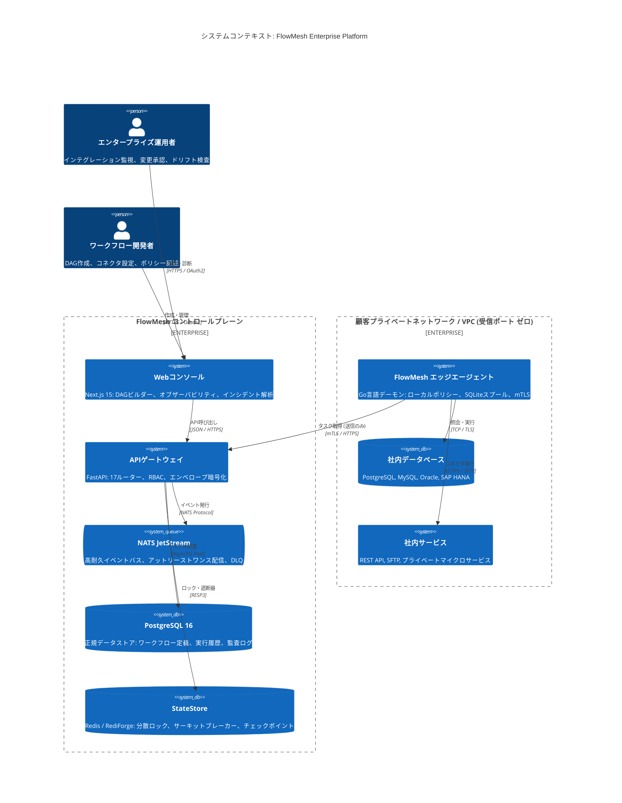
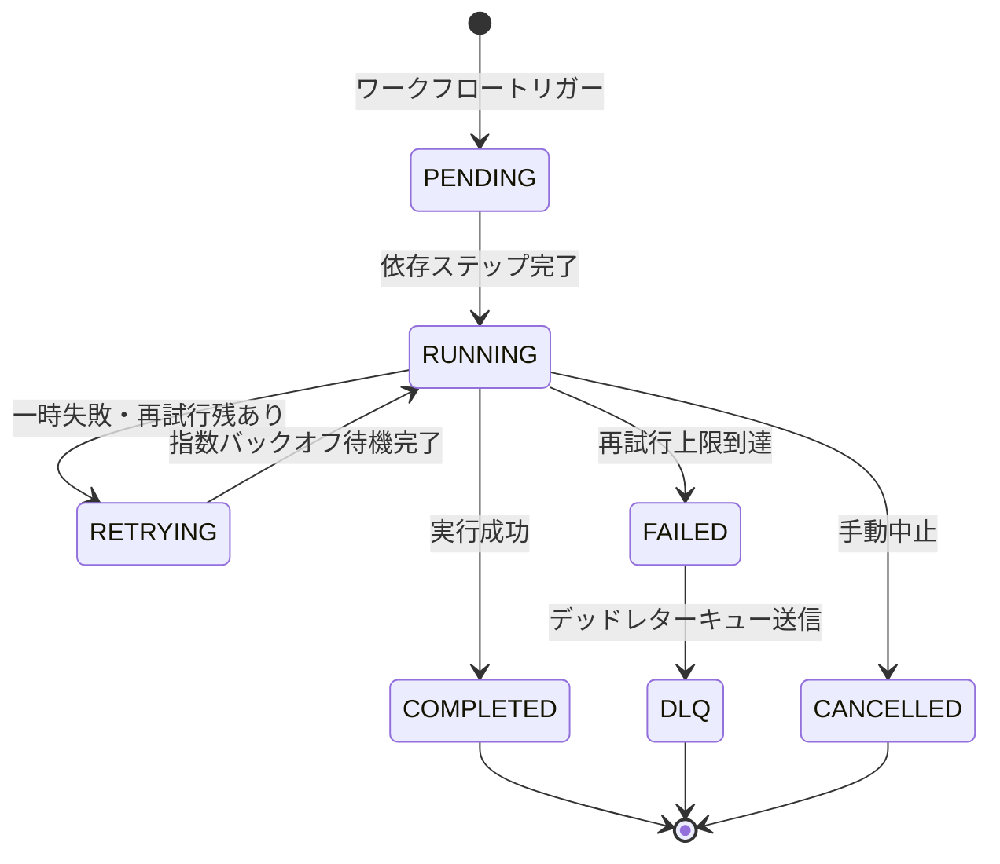

# FlowMesh — システムアーキテクチャ & 設計仕様書

<p align="center">
  
  
  
</p>

<p align="center">
  <b> 言語 / Language / 语言 / भाषा / Langue / 언어 / Idioma:</b><br>
  <a href="../../ARCHITECTURE.md">English</a> •
  <b>日本語</b> •
  <a href="./ARCHITECTURE.zh.md">简体中文</a> •
  <a href="./ARCHITECTURE.hi.md">हिन्दी</a> •
  <a href="./ARCHITECTURE.fr.md">Français</a> •
  <a href="./ARCHITECTURE.ko.md">한국어</a> •
  <a href="./ARCHITECTURE.es.md">Español</a>
</p>

---

## 目次

- [1. エグゼクティブアーキテクチャ概要](#1-エグゼクティブアーキテクチャ概要)
- [2. 設計原則と基本方針](#2-設計原則と基本方針)
- [3. システムコンテキストとC4モデル構成](#3-システムコンテキストとc4モデル構成)
- [4. コントロールプレーン設計 (FastAPI & Python 3.12+)](#4-コントロールプレーン設計-fastapi--python-312)
  - [4.1 ルーターの責務分離](#41-ルーターの責務分離)
  - [4.2 `TenantScopedRepository<T>` パターン](#42-tenantscopedrepositoryt-パターン)
  - [4.3 非同期SQLAlchemy 2.0による永続化](#43-非同期sqlalchemy-20による永続化)
- [5. データプレーンと分散ワークフローエンジン](#5-データプレーンと分散ワークフローエンジン)
  - [5.1 DAGの構造化とステップ解決](#51-dagの構造化とステップ解決)
  - [5.2 ステートマシンのライフサイクル](#52-ステートマシンのライフサイクル)
  - [5.3 指数バックオフとデッドレターキュー (DLQ)](#53-指数バックオフとデッドレターキュー-dlq)
- [6. エッジ実行プレーン (Go言語スタティックバイナリ)](#6-エッジ実行プレーン-go言語スタティックバイナリ)
  - [6.1 送信専用mTLSポーリングプロトコル (ADR-0001)](#61-送信専用mtlsポーリングプロトコル-adr-0001)
  - [6.2 暗号署名検証とRCEの根絶 (ADR-0002)](#62-暗号署名検証とrceの根絶-adr-0002)
  - [6.3 組み込みSQLite切断時スプールバッファ](#63-組み込みsqlite切断時スプールバッファ)
- [7. メッセージング基盤 (NATS JetStream)](#7-メッセージング基盤-nats-jetstream)
- [8. StateStore抽象化と分散合意 (ADR-0003)](#8-statestore抽象化と分散合意-adr-0003)
- [9. セキュリティアーキテクチャと脅威緩和策](#9-セキュリティアーキテクチャと脅威緩和策)
  - [9.1 エンベロープ暗号化キー階層 (AES-256-GCM)](#91-エンベロープ暗号化キー階層-aes-256-gcm)
  - [9.2 ロールベースアクセス制御 (RBAC)](#92-ロールベースアクセス制御-rbac)
  - [9.3 追記専用監査ログと暗号学的完全性](#93-追記専用監査ログと暗号学的完全性)
- [10. スキーマディスカバリとドリフト検知エンジン](#10-スキーマディスカバリとドリフト検知エンジン)
- [11. 分散オブザーバビリティとテレメトリ](#11-分散オブザーバビリティとテレメトリ)
- [12. 障害復旧 (DR) とネットワーク分断耐性](#12-障害復旧-dr-とネットワーク分断耐性)
- [13. アーキテクチャ決定記録 (ADR) 一覧](#13-アーキテクチャ決定記録-adr-一覧)

---

## 1. エグゼクティブアーキテクチャ概要

**FlowMesh**は、オンプレミスデータベース、基幹ERP、クラウドマイクロサービス、外部SaaS APIといった異種混合システム間における高信頼なワークフローオーケストレーションを実現するために設計された、イベント駆動型分散インテグレーション基盤です。

一般的なクラウドiPaaSとは異なり、FlowMeshは**ゼロトラスト環境およびデータ主権保護**を最優先に設計されています。企業のファイアウォール受信ポートを開放することなく、機密認証情報を第三者クラウドに預けることなく稼働します。

---

## 2. 設計原則と基本方針

1. **受信ポートゼロの境界防護**: コントロールプレーンから顧客LAN/VPCへのインバウンド接続は行いません。エッジエージェントからのアウトバウンドTLSトンネルのみを使用します。
2. **決定論的かつ再実行可能なDAG実行**: ワークフローは不変の有向非巡回グラフ（DAG）として定義され、ステップごとの状態遷移イベントにより障害地点からの正確な再実行が可能です。
3. **多層防御と暗号学的検証**: エッジで実行される全命令はコントロールプレーンによって暗号署名（Ed25519）され、ローカルポリシーエンジンによって検証されます。
4. **ステートストアの疎結合化**: 状態管理（分散ロック、リース、サーキットブレーカー）は抽象化され、Redis、超高速RediForge、インメモリを柔軟に選択できます。
5. **アーキテクチャによるマルチテナント分離**: `TenantScopedRepository`パターンによって、データレイヤーにおけるテナント間の誤混入を完全に排除します。
6. **ステートレスなコントロールプレーン**: APIゲートウェイインスタンスは局所状態を持たず、水平スケールが容易です。
7. **エンドツーエンドの観測可能性**: W3C分散トレースコンテキストがHTTP、メッセージキュー、エッジノードを跨いで透過的に伝播します。
8. **優雅な縮退運転 (Graceful Degradation)**: WAN障害時もエッジのローカルSQLiteスプールにより、データ欠損のない自律稼働を継続します。

---

## 3. システムコンテキストとC4モデル構成



---

## 4. コントロールプレーン設計 (FastAPI & Python 3.12+)

### 4.1 ルーターの責務分離
APIゲートウェイは `apps/api/app/routers/` に17の専門ルーターを持ちます：
- `workflows`: ワークフロー定義のCRUD、DAG検証、コンパイル。
- `runs`: 実行トリガー、ステップ再実行、中断、実行トレース。
- `agents`: エージェント登録、トークン管理、ハートビート、タスク配信。
- `connections`: コネクタ認証情報、エンベロープ暗号化、疎通確認。
- `drift`: スキーマメタデータ収集、ベースライン固定、差分評価。
- `policies`: ポリシー評価、デプロイ前安全性検証。
- `incidents`: インシデント集約、AIアシスタントによる原因診断。
- `state`: 分散ロック、サーキットブレーカー状態の監視。
- `audit`: 改ざん不可能なテナント監査ログ照会。
- `observability`: 分散トレース検索、レイテンシメトリクス。

### 4.2 `TenantScopedRepository<T>` パターン
全リポジトリ操作において `tenant_id` を必須条件として結合し、テナント横断の漏洩を防止します：

```python
class TenantScopedRepository(Generic[T]):
    def __init__(self, session: AsyncSession, tenant_id: str):
        self._session = session
        self._tenant_id = tenant_id

    async def get_by_id(self, entity_id: str) -> Optional[T]:
        stmt = (
            select(self._model)
            .where(self._model.id == entity_id)
            .where(self._model.tenant_id == self._tenant_id)
        )
        result = await self._session.execute(stmt)
        return result.scalar_one_or_none()
```

---

## 5. データプレーンと分散ワークフローエンジン

### 5.1 DAGの構造化とステップ解決
- ワークフローはトポロジカルソートによって依存関係が解決されます。
- 依存関係のないステップは並行してディスパッチされます。
- 分岐条件（`switch`, `parallel`, `join`）をサポート。

### 5.2 ステートマシンのライフサイクル



---

## 6. エッジ実行プレーン (Go言語スタティックバイナリ)

- **受信ゼロ通信 ([ADR-0001](docs/adr/ADR-0001-agent-outbound-only.md))**: コントロールプレーンに対する送信方向のmTLS通信のみ。
- **RCEの根絶 ([ADR-0002](docs/adr/ADR-0002-no-remote-code-execution.md))**: シェルコマンドの実行を禁止し、厳格に定義されたコネクタ（PostgreSQL、REST等）のみをEd25519署名検証のうえ実行。
- **SQLiteスプールバッファ**: 回線切断時もローカルDBに結果を退避し、復旧時に自動再送。

---

## 7. メッセージング基盤 (NATS JetStream)

- **CloudEvents 1.0準拠**: 統一されたJSONシリアライズ。
- **重複排除**: `Nats-Msg-Id` ヘッダーにSHA-256ダイジェストを付与し、ネットワーク再送時の二重実行を防止。

---

## 8. StateStore抽象化と分散合意 (ADR-0003)

- **統一インターフェース**: Redis、RediForge、In-Memoryに対応。
- **Redlock分散ロック**: Luaスクリプトを用いた安全なTTL更新と排他制御。
- **サーキットブレーカー**: 障害率に応じた `CLOSED` / `OPEN` / `HALF_OPEN` の遷移。

---

## 9. セキュリティアーキテクチャと脅威緩和策

- **エンベロープ暗号化**: マスター鍵（KEK）がテナント鍵（DEK）を保護し、認証情報はAES-256-GCMで暗号化。平文の保存は行いません。
- **4段階のRBAC**: `owner`, `operator`, `developer`, `viewer`。
- **ハッシュ連鎖監査ログ**: 前のログのハッシュを含むブロックチェーン構造で改ざんを検知。

---

## 10. スキーマディスカバリとドリフト検知エンジン

1. 定期的なメタデータ収集。
2. 承認済みベースラインとの比較。
3. 安全な差分（`WARNING`）と破壊的変更（`CRITICAL`）の自動判定。

---

## 11. 分散オブザーバビリティとテレメトリ

- **W3C TraceContext**: HTTPヘッダーからNATS、エージェントまで一貫したトレースIDを伝播。
- **Prometheusメトリクス**: `/metrics` エンドポイントで実行数・レイテンシ・遮断器状態を提供。

---

## 12. 障害復旧 (DR) とネットワーク分断耐性

| 障害シナリオ | 緩和策 | 目標復旧時間 (RTO) | 目標復旧地点 (RPO) |
| :--- | :--- | :--- | :--- |
| **APIノード障害** | ロードバランサによるステートレス自動切替 | $< 3\text{秒}$ | $0\text{秒}$ (データ消失なし) |
| **エージェント回線断** | ローカルSQLiteによる自律バッファリング | 回線復旧時自動 | $0\text{秒}$ (完全保護) |
| **Redis障害** | PostgreSQLの永続チェックポイントから再開 | Redis復旧時 | $0\text{秒}$ |
| **NATS障害** | JetStream Raftクラスタリングと再送 | $< 5\text{秒}$ | $0\text{秒}$ |
| **DB障害** | PostgreSQL 16ストリーミングレプリケーション | $< 30\text{秒}$ | $< 1\text{秒}$ |

---

## 13. アーキテクチャ決定記録 (ADR) 一覧

- **[ADR-0001: エージェントの送信専用アーキテクチャ](docs/adr/ADR-0001-agent-outbound-only.md)** (承認済)
- **[ADR-0002: 任意のリモートコード実行の排除](docs/adr/ADR-0002-no-remote-code-execution.md)** (承認済)
- **[ADR-0003: RedisおよびRediForge用ステートストア抽象化](docs/adr/ADR-0003-statestore-abstraction.md)** (承認済)
- **[ADR-0004: 不変ワークフローバージョニングとピン留め](docs/adr/ADR-0004-immutable-workflow-versions.md)** (承認済)
