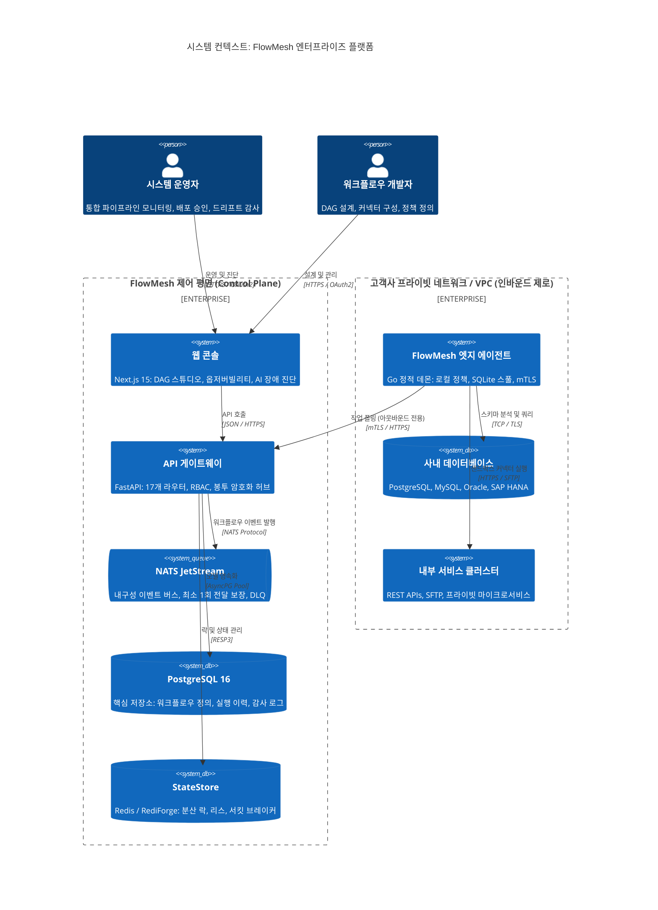
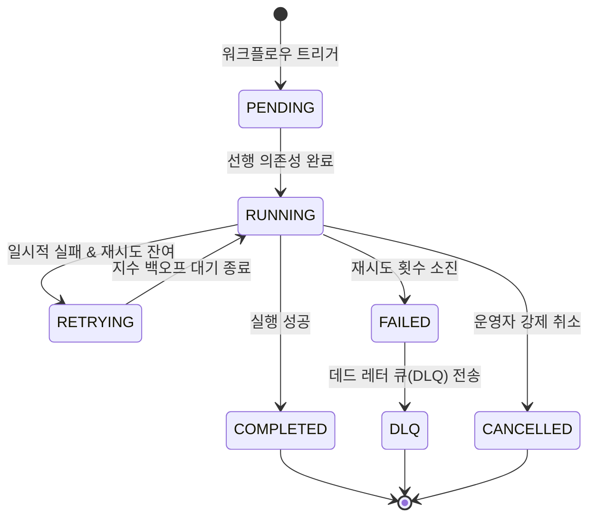

# FlowMesh — 시스템 아키텍처 및 설계 명세서 (Architecture & Design Specification)

<p align="center">
  
  
  
</p>

<p align="center">
  <b> 언어 / Language / 语言 / 言語 / भाषा / Langue / Idioma:</b><br>
  <a href="../../ARCHITECTURE.md">English</a> •
  <a href="./ARCHITECTURE.ja.md">日本語</a> •
  <a href="./ARCHITECTURE.zh.md">简体中文</a> •
  <a href="./ARCHITECTURE.hi.md">हिन्दी</a> •
  <a href="./ARCHITECTURE.fr.md">Français</a> •
  <b>한국어</b> •
  <a href="./ARCHITECTURE.es.md">Español</a>
</p>

---

## 목차

- [1. 총괄 아키텍처 개요](#1-총괄-아키텍처-개요)
- [2. 핵심 아키텍처 원칙 및 설계 지침](#2-핵심-아키텍처-원칙-및-설계-지침)
- [3. 시스템 컨텍스트 및 C4 토폴로지](#3-시스템-컨텍스트-및-c4-토폴로지)
- [4. 제어 평면(Control Plane) 아키텍처 (FastAPI & Python 3.12+)](#4-제어-평면control-plane-아키텍처-fastapi--python-312)
  - [4.1 17개 도메인 라우터 분해 구조](#41-17개-도메인-라우터-분해-구조)
  - [4.2 `TenantScopedRepository<T>` 멀티테넌트 데이터 격리 패턴](#42-tenantscopedrepositoryt-멀티테넌트-데이터-격리-패턴)
  - [4.3 비동기 SQLAlchemy 2.0 및 커넥션 풀링](#43-비동기-sqlalchemy-20-및-커넥션-풀링)
- [5. 데이터 평면(Data Plane) 및 분산 워크플로우 엔진](#5-데이터-평면data-plane-및-분산-워크플로우-엔진)
  - [5.1 DAG 구성 및 위상 정렬 의존성 해석](#51-dag-구성-및-위상-정렬-의존성-해석)
  - [5.2 상태 머신(State Machine) 수명 주기](#52-상태-머신state-machine-수명-주기)
  - [5.3 지수 백오프 재시도 및 데드 레터 큐 (DLQ)](#53-지수-백오프-재시도-및-데드-레터-큐-dlq)
- [6. 엣지 실행 평면(Edge Execution Plane) (Go 정적 데몬)](#6-엣지-실행-평면edge-execution-plane-go-정적-데몬)
  - [6.1 아웃바운드 전용 mTLS 폴링 프로토콜 (ADR-0001)](#61-아웃바운드-전용-mtls-폴링-프로토콜-adr-0001)
  - [6.2 암호화 명령 서명 및 임의 RCE 배제 (ADR-0002)](#62-암호화-명령-서명-및-임의-rce-배제-adr-0002)
  - [6.3 임베디드 SQLite 오프라인 스풀 버퍼](#63-임베디드-sqlite-오프라인-스풀-버퍼)
- [7. 메시징 백본 및 이벤트 스트리밍 (NATS JetStream)](#7-메시징-백본-및-이벤트-스트리밍-nats-jetstream)
- [8. StateStore 추상화 및 분산 합의 (ADR-0003)](#8-statestore-추상화-및-분산-합의-adr-0003)
- [9. 보안 아키텍처 및 위협 완화 전략](#9-보안-아키텍처-및-위협-완화-전략)
  - [9.1 봉투 암호화(Envelope Encryption) 계층 (AES-256-GCM)](#91-봉투-암호화envelope-encryption-계층-aes-256-gcm)
  - [9.2 역할 기반 접근 제어 (RBAC)](#92-역할-기반-접근-제어-rbac)
  - [9.3 불변 단방향 해시 체이닝 감사 로그](#93-불변-단방향-해시-체이닝-감사-로그)
- [10. 스키마 자동 감지 및 드리프트 분석 엔진](#10-스키마-자동-감지-및-드리프트-분석-엔진)
- [11. 분산 옵저버빌리티 및 텔레메트리](#11-분산-옵저버빌리티-및-텔레메트리)
- [12. 재해 복구 (DR) 및 네트워크 파티션 탄력성](#12-재해-복구-dr-및-네트워크-파티션-탄력성)
- [13. 아키텍처 결정 기록 (ADR) 인덱스](#13-아키텍처-결정-기록-adr-인덱스)

---

## 1. 총괄 아키텍처 개요

**FlowMesh**는 온프레미스 데이터베이스, 핵심 기간계 ERP 시스템(SAP, Oracle), 사내 마이크로서비스 및 클라우드 SaaS API 전반에 걸쳐 고가용성 비즈니스 워크플로우를 분산 오케스트레이션하기 위해 설계된 엔터프라이즈 통합 플랫폼입니다.

일반적인 퍼블릭 클라우드 iPaaS와 달리, FlowMesh는 **제로 트러스트 네트워크 보안과 데이터 주권(Data Sovereignty)**을 절대적 설계 원칙으로 삼습니다. 기업 방화벽의 수신 포트를 개방하지 않고, 민감한 인증 정보를 외부 클라우드에 위탁하지 않습니다.

---

## 2. 핵심 아키텍처 원칙 및 설계 지침

1. **수신 포트 제로 (Zero Inbound Attack Surface)**: 제어 평면은 고객 프라이빗 네트워크로 어떠한 인바운드 연결도 시도하지 않습니다. 고객 VPC 내부의 엣지 에이전트가 오직 아웃바운드 TLS 연결만을 맺습니다.
2. **결정론적 및 재실행 가능한 DAG 실행**: 워크플로우는 불변의 유향 비순환 그래프(DAG)로 정의됩니다. 각 단계의 상태 전이마다 이벤트가 발행되어 장애 발생 지점부터 완벽한 재실행이 가능합니다.
3. **심층 방어 및 암호학적 검증**: 엣지 노드에서 실행되는 모든 작업 명령은 제어 평면의 Ed25519 서명 검증 및 로컬 정책 엔진 통과 후에만 실행됩니다.
4. **상태 관리 계층 분리**: 분산 락, 리스, 체크포인트 및 서킷 브레이커 상태는 단일 StateStore 인터페이스 뒤로 추상화되어 Redis, RediForge, 메모리를 지원합니다.
5. **구조적 멀티테넌트 격리**: `TenantScopedRepository` 패턴을 강제하여 데이터 계층에서 테넌트 간 데이터 혼입을 원천 차단합니다.
6. **상태 비저장(Stateless) 제어 평면**: API 게이트웨이는 로컬 세션 상태를 저장하지 않아 손쉬운 수평 확장이 가능합니다.
7. **전 구간 분산 추적**: W3C TraceContext가 HTTP 경계, NATS 큐, 엣지 에이전트를 가로질러 끊김 없이 전파됩니다.
8. **우아한 성능 저하 (Graceful Degradation)**: WAN 네트워크 단절 시에도 엣지 에이전트의 로컬 SQLite 버퍼를 통해 무손실 자율 운영을 유지합니다.

---

## 3. 시스템 컨텍스트 및 C4 토폴로지



---

## 4. 제어 평면(Control Plane) 아키텍처 (FastAPI & Python 3.12+)

### 4.1 17개 도메인 라우터 분해 구조
`apps/api/app/routers/` 내에 17개의 전문 도메인 라우터가 배치되어 있습니다:
- `workflows`: 워크플로우 CRUD, DAG 검증 및 버전 고정 컴파일.
- `runs`: 실행 트리거, 단계별 재실행, 비상 중단.
- `agents`: 에이전트 등록, 양방향 인증 토큰 발급 및 하트비트 수집.
- `connections`: 자격 증명 보관, 봉투 암호화, 연결성 테스트.
- `drift`: 메타데이터 수집, 베이스라인 고정, 드리프트 차이 분석.
- `policies`: 정책 기반 코드(Policy-as-Code) 배포 전 적합성 검사.
- `incidents`: 장애 원인 분석 및 AI 어시스턴트 기반 인시던트 분류.
- `state`: 분산 락 리스 및 서킷 브레이커 상태 실시간 조회.
- `audit`: 위변조 방지 테넌트 감사 로그 검색.
- `observability`: 실시간 분산 트레이스 및 지연 시간 메트릭.

### 4.2 `TenantScopedRepository<T>` 멀티테넌트 데이터 격리 패턴
```python
class TenantScopedRepository(Generic[T]):
    def __init__(self, session: AsyncSession, tenant_id: str):
        self._session = session
        self._tenant_id = tenant_id

    async def get_by_id(self, entity_id: str) -> Optional[T]:
        stmt = (
            select(self._model)
            .where(self._model.id == entity_id)
            .where(self._model.tenant_id == self._tenant_id)
        )
        result = await self._session.execute(stmt)
        return result.scalar_one_or_none()
```

---

## 5. 데이터 평면(Data Plane) 및 분산 워크플로우 엔진

### 5.1 DAG 구성 및 위상 정렬 의존성 해석
- 선언적 JSON 스키마를 기반으로 의존성 위상 정렬을 수행합니다.
- 선행 조건이 완료된 독립적 단계는 병렬로 즉시 디스패치됩니다.
- 조건부 분기(`switch`, `parallel`, `join`)를 완벽하게 지원합니다.

### 5.2 상태 머신(State Machine) 수명 주기



---

## 6. 엣지 실행 평면(Edge Execution Plane) (Go 정적 데몬)

- **순수 아웃바운드 연결 ([ADR-0001](docs/adr/ADR-0001-agent-outbound-only.md))**: 제어 평면을 향한 아웃바운드 mTLS 풀링만 수행하여 방화벽 오픈을 배제합니다.
- **임의 RCE 원천 차단 ([ADR-0002](docs/adr/ADR-0002-no-remote-code-execution.md))**: 임의의 셸 스크립트 실행을 금지하고, 암호화 서명된 표준 커넥터 작업만 샌드박스에서 구동합니다.
- **오프라인 SQLite 스풀링**: 네트워크 장애 발생 시 로컬 DB에 결과를 임시 적재하고 복구 즉시 순차 재전송합니다.

---

## 7. 메시징 백본 및 이벤트 스트리밍 (NATS JetStream)

- **CloudEvents 1.0 준수**: 모든 메시지를 표준화된 포맷으로 직렬화.
- **중복 배제 메커니즘**: `Nats-Msg-Id` 헤더에 SHA-256 해시를 주입하여 재전송 시에도 멱등성을 보장.

---

## 8. StateStore 추상화 및 분산 합의 (ADR-0003)

- **통합 드라이버**: Redis, RediForge 및 In-Memory 지원.
- **원자적 분산 락**: Lua 스크립트를 통한 안전한 락 획득 및 리스 자동 연장.
- **적응형 서킷 브레이커**: 실패율에 따라 `CLOSED`, `OPEN`, `HALF_OPEN` 상태를 유기적으로 전이.

---

## 9. 보안 아키텍처 및 위협 완화 전략

- **봉투 암호화(Envelope Encryption)**: 마스터 키(KEK)가 테넌트 데이터 키(DEK)를 래핑하고, AES-256-GCM 알고리즘으로 자격 증명을 암호화합니다.
- **4단계 RBAC 체계**: `owner`, `operator`, `developer`, `viewer`.
- **해시 체인 감사 추적**: 이전 로그의 SHA-256 다이제스트를 연결하여 기록 위변조를 수학적으로 차단합니다.

---

## 10. 스키마 자동 감지 및 드리프트 분석 엔진

- 정기적인 메타데이터 추출.
- 승인된 기준점(Baseline)과 실시간 비교:
  - **`WARNING` (호환 가능)**: 선택적 컬럼 추가.
  - **`CRITICAL` (호환 파괴)**: 기존 컬럼 삭제, 데이터 타입 변경.

---

## 11. 분산 옵저버빌리티 및 텔레메트리

- **W3C TraceContext 표준화**: 브라우저 HTTP 요청부터 NATS 큐, 엣지 커넥터까지 단일 트레이스 ID로 연결.
- **Prometheus 메트릭**: `/metrics` 엔드포인트를 통해 실시간 처리량, 지연 시간, 서킷 상태 제공.

---

## 12. 재해 복구 (DR) 및 네트워크 파티션 탄력성

| 장애 시나리오 | 대응 및 복구 메커니즘 | 목표 복구 시간 (RTO) | 데이터 손실 목표 (RPO) |
| :--- | :--- | :--- | :--- |
| **API 노드 장애** | 로드 밸런서를 통한 무상태 인스턴스 자동 페일오버 | $< 3\text{초}$ | $0\text{초}$ (손실 없음) |
| **엣지 에이전트 WAN 단절**| 로컬 SQLite 자동 적재; 복구 시 자동 정렬 전송 | 네트워크 복구 즉시 | $0\text{초}$ (로컬 보존) |
| **Redis 장애** | PostgreSQL 영구 체크포인트로부터 워크플로우 재개 | Redis 복구 즉시 | $0\text{초}$ |
| **NATS 클러스터 장애** | JetStream Raft 합의 엔진에 의한 메시지 복제 유지 | $< 5\text{초}$ | $0\text{초}$ |
| **데이터베이스 장애** | PostgreSQL 16 복제본 자동 승격 | $< 30\text{초}$ | $< 1\text{초}$ |

---

## 13. 아키텍처 결정 기록 (ADR) 인덱스

- **[ADR-0001: 엣지 에이전트 아웃바운드 전용 아키텍처](docs/adr/ADR-0001-agent-outbound-only.md)** (승인됨)
- **[ADR-0002: 임의 원격 코드 실행(RCE) 배제](docs/adr/ADR-0002-no-remote-code-execution.md)** (승인됨)
- **[ADR-0003: Redis 및 RediForge용 범용 StateStore 추상화](docs/adr/ADR-0003-statestore-abstraction.md)** (승인됨)
- **[ADR-0004: 불변 워크플로우 버전 관리 및 핀 고정](docs/adr/ADR-0004-immutable-workflow-versions.md)** (승인됨)
