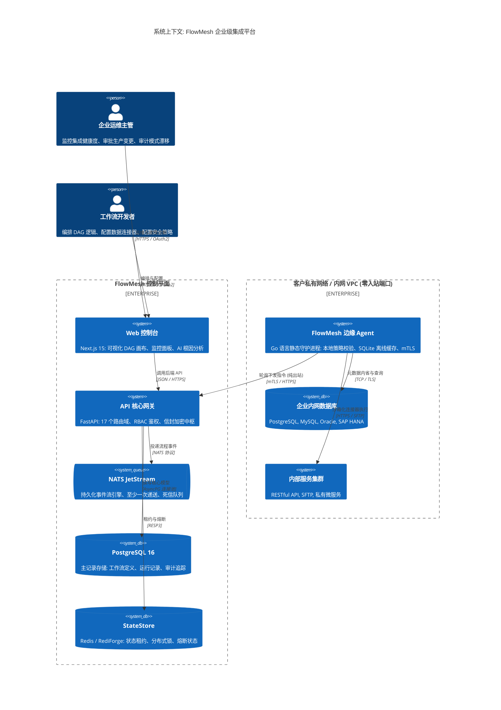
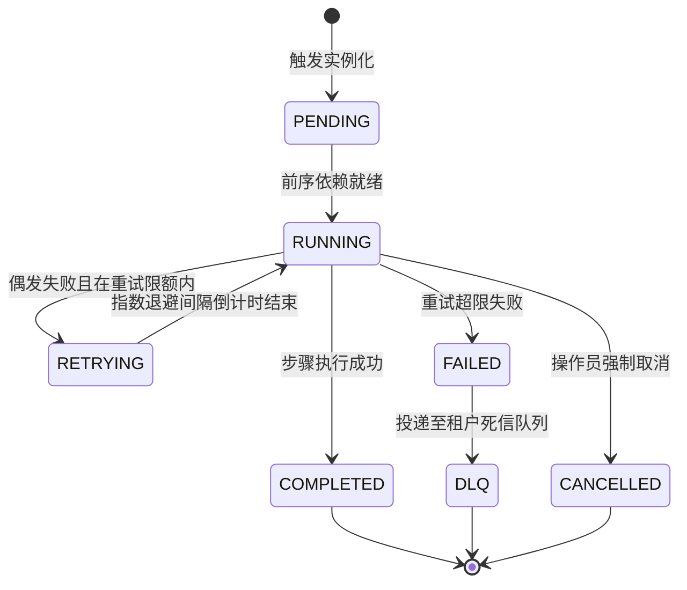

# FlowMesh — 系统架构与技术设计规范

<p align="center">
  
  
  
</p>

<p align="center">
  <b> 语言 / Language / 言語 / भाषा / Langue / 언어 / Idioma:</b><br>
  <a href="../../ARCHITECTURE.md">English</a> •
  <a href="./ARCHITECTURE.ja.md">日本語</a> •
  <b>简体中文</b> •
  <a href="./ARCHITECTURE.hi.md">हिन्दी</a> •
  <a href="./ARCHITECTURE.fr.md">Français</a> •
  <a href="./ARCHITECTURE.ko.md">한국어</a> •
  <a href="./ARCHITECTURE.es.md">Español</a>
</p>

---

## 目录

- [1. 执行架构综述](#1-执行架构综述)
- [2. 核心架构设计原则](#2-核心架构设计原则)
- [3. 系统上下文与 C4 拓扑设计](#3-系统上下文与-c4-拓扑设计)
- [4. 控制平面架构设计 (FastAPI & Python 3.12+)](#4-控制平面架构设计-fastapi--python-312)
  - [4.1 领域路由分解](#41-领域路由分解)
  - [4.2 `TenantScopedRepository<T>` 多租户数据访问模式](#42-tenantscopedrepositoryt-多租户数据访问模式)
  - [4.3 数据库持久层与异步 SQLAlchemy 2.0](#43-数据库持久层与异步-sqlalchemy-20)
- [5. 数据平面与分布式工作流引擎](#5-数据平面与分布式工作流引擎)
  - [5.1 DAG 构建与依赖拓扑解析](#51-dag-构建与依赖拓扑解析)
  - [5.2 状态机生命周期演进](#52-状态机生命周期演进)
  - [5.3 指数退避重试与死信队列 (DLQ)](#53-指数退避重试与死信队列-dlq)
- [6. 边缘执行平面 (Go 静态守护进程)](#6-边缘执行平面-go-静态守护进程)
  - [6.1 纯出站 mTLS 轮询机制 (ADR-0001)](#61-纯出站-mtls-轮询机制-adr-0001)
  - [6.2 密码学指令签名与杜绝 RCE (ADR-0002)](#62-密码学指令签名与杜绝-rce-adr-0002)
  - [6.3 嵌入式 SQLite 断网持久缓冲队列](#63-嵌入式-sqlite-断网持久缓冲队列)
- [7. 消息中枢与事件底座 (NATS JetStream)](#7-消息中枢与事件底座-nats-jetstream)
- [8. StateStore 抽象与分布式共识 (ADR-0003)](#8-statestore-抽象与分布式共识-adr-0003)
- [9. 安全架构与威胁抵御](#9-安全架构与威胁抵御)
  - [9.1 信封加密密钥层次模型 (AES-256-GCM)](#91-信封加密密钥层次模型-aes-256-gcm)
  - [9.2 基于角色的权限访问控制 (RBAC)](#92-基于角色的权限访问控制-rbac)
  - [9.3 追加式审计日志与密码学防篡改](#93-追加式审计日志与密码学防篡改)
- [10. Schema 自动发现与漂移分析引擎](#10-schema-自动发现与漂移分析引擎)
- [11. 全链路分布式可观测性与遥测](#11-全链路分布式可观测性与遥测)
- [12. 灾难恢复 (DR) 与网络分区容错](#12-灾难恢复-dr-与网络分区容错)
- [13. 架构决策记录 (ADR) 索引](#13-架构决策记录-adr-索引)

---

## 1. 执行架构综述

**FlowMesh** 是一套分布式、事件驱动的企业级混合云集成底座，旨在为异构 IT 资产（包括企业本地数据库、SAP/Oracle ERP、私有微服务与第三方云端 SaaS API）提供具备企业级 SLA 保障的工作流编排能力。

与传统公有云 iPaaS 方案根本不同，FlowMesh 基于**零信任网络边界与数据主权保护**理念打造。它无需打通客户防火墙的入站监听端口，亦无需在公有云第三方持久化企业真实敏感数据。

---

## 2. 核心架构设计原则

1. **零入站攻击暴露面**: 控制平面绝不向客户私有网络发起入站网络请求，所有通信均由客户 VPC 内的 Edge Agent 通过出站安全加密隧道发起。
2. **确定性与可重放执行**: 工作流均基于不可变有向无环图（DAG）建模。每个任务步骤均驱动状态转移事件上报，支持因故障中断后精确断点重放。
3. **纵深防御与加密防伪**: 所有流向边缘节点的控制指令必须由控制平面私钥进行 Ed25519 签名，边缘节点在通过本地策略引擎判定后方可执行。
4. **状态引擎解耦设计**: 分布式租约、互斥锁、检查点与熔断状态由抽象 StateStore 接口统一托管，适配 Redis、极速 RediForge 或本地内存。
5. **内生多租户强制隔离**: 数据访问层严格依赖 `TenantScopedRepository` 模式，所有数据库查询必须强行绑定 `tenant_id` 过滤条件。
6. **无状态控制平面**: API 网关节点不保存任何本地会话状态，支持零摩擦水平弹性伸缩。
7. **全链路端到端追踪**: 全系统遵循 W3C TraceContext 规范，实现 HTTP 网关、NATS 消息队列、边缘 Agent 到底层 Connector 的追踪链路串联。
8. **优雅降级与网络容错**: 边缘节点自带轻量 SQLite 缓冲，当 WAN 广域网波动或断连时，任务结果在本地安全暂存，网络恢复后自愈对齐。

---

## 3. 系统上下文与 C4 拓扑设计



---

## 4. 控制平面架构设计 (FastAPI & Python 3.12+)

### 4.1 领域路由分解
控制平面在 `apps/api/app/routers/` 目录下实现了高内聚的 17 个专业领域路由：
- `workflows`: 负责工作流元数据 CRUD、DAG 合法性验证与版本固化编译。
- `runs`: 执行实例实例化、外部触发、步骤精准重试与人工中止。
- `agents`: 边缘 Agent 动态注册、双向认证令牌颁发与心跳状态检测。
- `connections`: 安全凭证托管、信封加密加解密流转与连接健康测试。
- `drift`: 外部数据源 Schema 内省分析、基线锁定与字段级语义比对。
- `policies`: 策略即代码校验引擎、流程发布前合规阻断。
- `incidents`: 告警归因聚类、根因诊断与 AI 运维助理辅助排障。
- `state`: 实时巡检全局分布式锁租约与连接器熔断器状态机。
- `audit`: 提供只读、不可篡改的租户合规审计追踪查询。
- `observability`: 全链路 Trace 跨域查询、Span 依赖拓扑与性能分析。

### 4.2 `TenantScopedRepository<T>` 多租户数据访问模式
为坚决杜绝因开发疏忽导致的租户数据越权访问，平台建立强制仓储规范：

```python
class TenantScopedRepository(Generic[T]):
    def __init__(self, session: AsyncSession, tenant_id: str):
        self._session = session
        self._tenant_id = tenant_id

    async def get_by_id(self, entity_id: str) -> Optional[T]:
        stmt = (
            select(self._model)
            .where(self._model.id == entity_id)
            .where(self._model.tenant_id == self._tenant_id)
        )
        result = await self._session.execute(stmt)
        return result.scalar_one_or_none()
```

---

## 5. 数据平面与分布式工作流引擎

### 5.1 DAG 构建与依赖拓扑解析
- 声明式 JSON Schema 解析入库。
- 自动计算入度为 0 的初始步骤并由引擎并行分发。
- 支持高级流控模式：`switch`（多路条件分支）、`parallel`（多分支并行）和 `join`（并行汇聚）。

### 5.2 状态机生命周期演进



---

## 6. 边缘执行平面 (Go 静态守护进程)

- **纯出站单向网络模型 ([ADR-0001](docs/adr/ADR-0001-agent-outbound-only.md))**: 边缘节点仅主动向上建立 mTLS 长连接，彻底消除公网入站暴露面。
- **坚决拒绝任意远程代码执行 ([ADR-0002](docs/adr/ADR-0002-no-remote-code-execution.md))**: 摒弃任何 Shell/Bash 脚本透传方案，控制平面下发带 Ed25519 签名的强类型操作，边缘沙箱执行。
- **本地 SQLite 断网自愈缓冲**: 发生网络分区时，执行结果直接入库本地 SQLite，WAN 恢复后顺序平滑回传。

---

## 7. 消息中枢与事件底座 (NATS JetStream)

- **CloudEvents 1.0 标准格式**: 全系统事件统一采用 CNCF 标准规范进行序列化。
- **幂等防重去重机制**: 利用 `Nats-Msg-Id` 头植入 SHA-256 复合摘要，杜绝因网络震荡重发导致的重复执行。

---

## 8. StateStore 抽象与分布式共识 (ADR-0003)

- **统一抽象**: 提供 Redis、RediForge 和 In-Memory 三种驱动实现。
- **原子分布式锁**: 基于 Lua 脚本实现租约自动续期与原子释放。
- **自适应熔断器**: 实时监控下游失败率，严格在 `CLOSED`、`OPEN` 和 `HALF_OPEN` 三态间流转。

---

## 9. 安全架构与威胁抵御

- **信封加密方案**: 主密钥（KEK）包裹租户数据密钥（DEK），敏感信息使用 AES-256-GCM 高强度加密，严防明文泄露。
- **四级 RBAC 矩阵**: `owner`（租户管理员）、`operator`（系统运维）、`developer`（开发工程师）、`viewer`（访客只读）。
- **哈希链审计追踪**: 审计日志内置前序区块 SHA-256 摘要，保证审计记录不可抵赖、不可篡改。

---

## 10. Schema 自动发现与漂移分析引擎

通过连接器内省数据库元数据，构建基线快照。后续巡检比对自动识别：
- **`WARNING`（兼容性变更）**: 新增非必填列、放宽列长度。
- **`CRITICAL`（破坏性变更）**: 删除列、变更列类型、新增无默认值的必填约束。

---

## 11. 全链路分布式可观测性与遥测

- **W3C TraceContext 贯穿全流程**: 从浏览器 HTTP 请求、API 网关、NATS 事件消息到边缘 Agent，Trace ID 始终保持串联。
- **Prometheus 监控规范**: 自动暴露 `/metrics` 指标接口，结合 Grafana 提供开箱即用看板。

---

## 12. 灾难恢复 (DR) 与网络分区容错

| 故障场景 | 容灾防线 | 业务恢复目标 (RTO) | 数据恢复点目标 (RPO) |
| :--- | :--- | :--- | :--- |
| **API 节点意外宕机** | 无状态网关群负载均衡瞬时剔除与重试 | $< 3\text{ 秒}$ | $0\text{ 秒}$ (无数据丢失) |
| **边缘 Agent WAN 断网** | 本地 SQLite 持续缓冲，断网期间本地继续轮转 | 网络恢复即刻自动自愈 | $0\text{ 秒}$ (全量暂存) |
| **Redis 节点故障** | 工作流引擎挂起未完成步骤，从 PostgreSQL 固化断点恢复 | Redis 恢复即就绪 | $0\text{ 秒}$ |
| **NATS 集群故障** | JetStream Raft 共识保证消息副本完备 | $< 5\text{ 秒}$ | $0\text{ 秒}$ |
| **数据库主库故障** | PostgreSQL 16 自动故障转移至只读从库并提升为主 | $< 30\text{ 秒}$ | $< 1\text{ 秒}$ |

---

## 13. 架构决策记录 (ADR) 索引

- **[ADR-0001: 边缘 Agent 纯出站安全架构](docs/adr/ADR-0001-agent-outbound-only.md)** (已采纳)
- **[ADR-0002: 拒绝任意远程代码执行](docs/adr/ADR-0002-no-remote-code-execution.md)** (已采纳)
- **[ADR-0003: Redis 与 RediForge 状态存储抽象层](docs/adr/ADR-0003-statestore-abstraction.md)** (已采纳)
- **[ADR-0004: 不可变工作流版本管理与执行锁定](docs/adr/ADR-0004-immutable-workflow-versions.md)** (已采纳)
