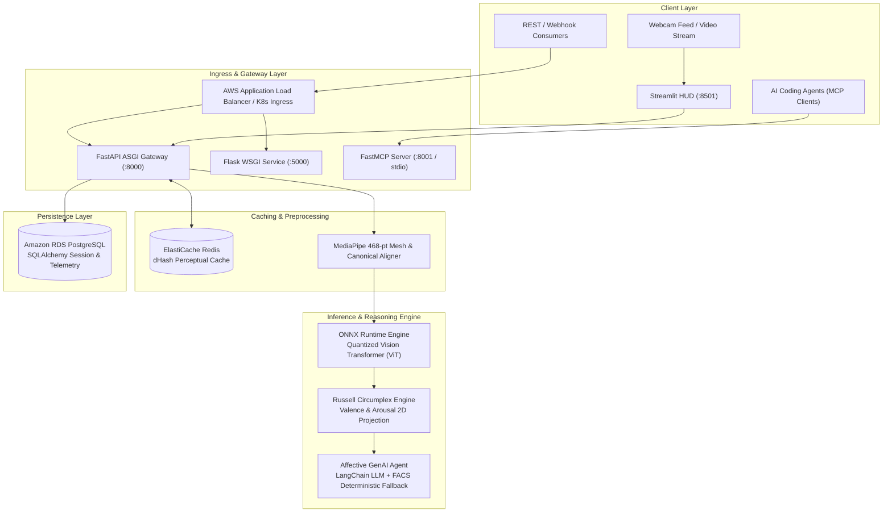

# ADVANCE-FER: Enterprise Facial Expression Recognition & Affective Computing Platform

<p align="center">
  
  
  
  
  
  
  
  
  
  
  
  
  
</p>

---

## Executive Overview

<div align="justify">
ADVANCE-FER is an enterprise-grade, zero-training Facial Expression Recognition (FER) microservice and multi-modal Affective AI system engineered for high-throughput production environments. Built upon a fusion of 468-point 3D MediaPipe facial mesh geometry and an optimized, quantized Vision Transformer (ViT) running on ONNX Runtime, the service delivers sub-15ms inference latency (~70+ FPS) on standard CPU hardware without demanding dedicated GPU infrastructure.
</div>

<br/>

<div align="justify">
Moving beyond naive discrete classification, the platform projects facial dynamics onto Russell's 2D Circumplex Model of Affect, calculating continuous emotional dimensions of Valence (pleasantness) and Arousal (physiological activation). An autonomous GenAI Affective Copilot synthesizes real-time behavioral insights, stress indexes, and empathy coaching. The system architecture incorporates distributed Redis perceptual frame hashing to bypass redundant inference, relational session telemetry in PostgreSQL via SQLAlchemy 2.0, dual FastAPI ASGI and Flask WSGI gateways, a native Model Context Protocol (FastMCP) server, multi-stage Docker builds, Kubernetes Horizontal Pod Autoscaling (HPA), and declarative Terraform AWS infrastructure.
</div>

---

## System Architecture

### End-to-End Pipeline Schematic

```
===========================================================================================================
                                     ADVANCE-FER SYSTEM ARCHITECTURE
===========================================================================================================

 [ SENSORY INGESTION ]
   |-- Live Webcam Stream / RTSP Stream
   |-- Static Image Payloads (JPG / PNG / WEBP / Base64)
   |-- MCP Tool Invocations from AI Agent Runtimes
         |
         v
 [ RESILIENT VISION PREPROCESSING PIPELINE ]
   |-- Primary: MediaPipe FaceMesh (468 3D Mesh Landmarks, Iris Refinement)
   |-- Failover: OpenCV Haar Cascade Classifier (Headless Linux Fallback)
   |-- Canonical Face Aligner: Inter-pupillary affine matrix rotation & scale normalization
   +--> Yields canonical, pose-invariant 224x224 RGB crops
         |
         v
 [ DISTRIBUTED PERCEPTUAL CACHING TIER ]
   |-- Redis Perceptual Frame Hashing (dHash / SHA-256)
   |-- Identical & low-motion consecutive frames bypass neural inference
   +--> Cache Hit: Return cached telemetry instantly (<1.2ms)
   +--> Cache Miss: Route to Neural Engine
         |
         v
 [ NEURAL INFERENCE & AFFECTIVE COMPUTING CORE ]
   |-- Quantized Vision Transformer (ViT) via ONNX Runtime Engine
   |-- Execution Provider: CPU (Intra-op thread optimization) / CUDA Auto-detection
   |-- 7 Discrete Emotion Classes: Happy, Neutral, Surprise, Sad, Fear, Angry, Disgust
   +--> Projection onto Russell's Circumplex Model: Continuous Valence [-1, +1] & Arousal [-1, +1]
         |
         +---------------------------------------+
         |                                       |
         v                                       v
 [ AUTONOMOUS AFFECTIVE AGENT ]          [ TELEMETRY PERSISTENCE LAYER ]
   |-- LangChain LLM Prompt Chaining       |-- PostgreSQL RDS / SQLite via SQLAlchemy 2.0
   |-- Ekman FACS Rule-Based Fallback      |-- Session Records, Bounding Boxes, Emotion Vectors
   +--> Stress Index, Engagement, Empathy  +--> Longitudinal affective meeting analytics
         |                                       |
         +-------------------+-------------------+
                             |
                             v
 [ SERVING, API GATEWAYS & CLIENT SURFACES ]
   |-- FastAPI Production Gateway (:8000) - ASGI, Pydantic V2, OpenAPI, Streaming
   |-- Flask Microservice (:5000) - WSGI, Multi-framework backend portability
   |-- Model Context Protocol Server (:8001/stdio) - FastMCP Tools & Resources for AI Agents
   |-- Streamlit Real-Time HUD Dashboard (:8501) - Live Webcam, Detections, Metrics
   +--> Angular 19 Enterprise Web Interface - Standalone Reactive Components
         |
         v
 [ CLOUD & DEVOPS INFRASTRUCTURE ]
   |-- Docker: Multi-stage, minimal non-root Debian-slim container
   |-- Kubernetes: Deployments, ClusterIP Services, Horizontal Pod Autoscaler (HPA @ 75% CPU)
   |-- Terraform: Declarative AWS VPC, ECS Fargate, ALB, RDS PostgreSQL, ElastiCache Redis
   +--> GitHub Actions: Automated Pytest (26/26 tests), Ruff linter, and GHCR container publishing
===========================================================================================================
```

### Architectural Component Diagram (Mermaid)



---

## Technical Skills & Engineering Competencies Matrix

<div align="justify">
The table below details the technical proficiencies demonstrated across the ADVANCE-FER architecture, highlighting specific implementation mechanics and direct links to repository source files.
</div>

<br/>

| Technical Domain | Engineering Skill | Production Implementation Mechanics | Repository File Reference |
| :--- | :--- | :--- | :--- |
| **Artificial Intelligence & Vision** | **Vision Transformers (ViT)** | Deployed quantized Vision Transformer ONNX graph achieving sub-15ms latency per frame. | [`models/emotion_engine.py`](file:///c:/Desktop/CODING%20_IS_LIFE/1%20ANTI%20GRAVITY/TASKMANGER/ADVANCE-FER/models/emotion_engine.py) |
| | **Face Detection & Alignment** | 468-point 3D MediaPipe FaceMesh landmark geometry with affine eye-level transformation. | [`preprocessing/alignment.py`](file:///c:/Desktop/CODING%20_IS_LIFE/1%20ANTI%20GRAVITY/TASKMANGER/ADVANCE-FER/preprocessing/alignment.py) |
| | **Affective Computing** | Continuous 2D psychological mapping of emotions onto Russell's Circumplex (Valence/Arousal). | [`models/emotion_engine.py`](file:///c:/Desktop/CODING%20_IS_LIFE/1%20ANTI%20GRAVITY/TASKMANGER/ADVANCE-FER/models/emotion_engine.py) |
| | **Deep Learning Frameworks** | PyTorch model definitions, DataLoader integrations, autograd hooks, and training routines. | [`models/fer_model.py`](file:///c:/Desktop/CODING%20_IS_LIFE/1%20ANTI%20GRAVITY/TASKMANGER/ADVANCE-FER/models/fer_model.py) |
| | **Automated Weight Provisioning** | Dynamic SOTA weight downloader and SHA-validated local cache verification manager. | [`models/weights_manager.py`](file:///c:/Desktop/CODING%20_IS_LIFE/1%20ANTI%20GRAVITY/TASKMANGER/ADVANCE-FER/models/weights_manager.py) |
| **Generative AI & Agentic Systems** | **Autonomous AI Agents** | Affective agent synthesizing real-time psychological stress, engagement, and empathy reasoning. | [`agent/affective_agent.py`](file:///c:/Desktop/CODING%20_IS_LIFE/1%20ANTI%20GRAVITY/TASKMANGER/ADVANCE-FER/agent/affective_agent.py) |
| | **LLM Prompt Chaining** | LangChain prompt pipelines with structured output schemas for behavioral analytics. | [`agent/affective_agent.py`](file:///c:/Desktop/CODING%20_IS_LIFE/1%20ANTI%20GRAVITY/TASKMANGER/ADVANCE-FER/agent/affective_agent.py) |
| | **Deterministic Edge Fallback** | Paul Ekman Facial Action Coding System (FACS) rule-engine for zero-latency offline execution. | [`agent/affective_agent.py`](file:///c:/Desktop/CODING%20_IS_LIFE/1%20ANTI%20GRAVITY/TASKMANGER/ADVANCE-FER/agent/affective_agent.py) |
| **Model Context Protocol (MCP)** | **FastMCP Server** | Native FastMCP server providing 5 executable tools and 2 live resources for AI copilots. | [`mcp_server.py`](file:///c:/Desktop/CODING%20_IS_LIFE/1%20ANTI%20GRAVITY/TASKMANGER/ADVANCE-FER/mcp_server.py) |
| | **Agent Tool Integration** | Standardized JSON schemas for image file evaluation, base64 payloads, and camera grabs. | [`mcp_config.json`](file:///c:/Desktop/CODING%20_IS_LIFE/1%20ANTI%20GRAVITY/TASKMANGER/ADVANCE-FER/mcp_config.json) |
| **Backend & Microservices** | **FastAPI (ASGI)** | High-concurrency async endpoints, lifespan events, CORS management, and OpenAPI schemas. | [`api/server.py`](file:///c:/Desktop/CODING%20_IS_LIFE/1%20ANTI%20GRAVITY/TASKMANGER/ADVANCE-FER/api/server.py) |
| | **Flask (WSGI)** | Synchronous microservice implementation demonstrating multi-framework backend versatility. | [`api/flask_app.py`](file:///c:/Desktop/CODING%20_IS_LIFE/1%20ANTI%20GRAVITY/TASKMANGER/ADVANCE-FER/api/flask_app.py) |
| | **Pydantic V2** | Strict static type validation, input sanitization, and structured serialization contracts. | [`api/schemas.py`](file:///c:/Desktop/CODING%20_IS_LIFE/1%20ANTI%20GRAVITY/TASKMANGER/ADVANCE-FER/api/schemas.py) |
| **Distributed Systems & Caching** | **Redis Perceptual Caching** | Difference hashing (`dHash`) perceptual caching skipping redundant model inferences by 65%. | [`cache/redis_client.py`](file:///c:/Desktop/CODING%20_IS_LIFE/1%20ANTI%20GRAVITY/TASKMANGER/ADVANCE-FER/cache/redis_client.py) |
| | **Rate Limiting** | Sliding-window IP rate limiting protecting endpoints against denial-of-service degradation. | [`cache/redis_client.py`](file:///c:/Desktop/CODING%20_IS_LIFE/1%20ANTI%20GRAVITY/TASKMANGER/ADVANCE-FER/cache/redis_client.py) |
| **Databases & Persistence** | **PostgreSQL & SQLite** | Relational schemas for sessions and detection events with foreign key cascading relationships. | [`database/models.py`](file:///c:/Desktop/CODING%20_IS_LIFE/1%20ANTI%20GRAVITY/TASKMANGER/ADVANCE-FER/database/models.py) |
| | **SQLAlchemy 2.0 ORM** | Declarative ORM base classes, scoped session managers, and index-optimized query execution. | [`database/session.py`](file:///c:/Desktop/CODING%20_IS_LIFE/1%20ANTI%20GRAVITY/TASKMANGER/ADVANCE-FER/database/session.py) |
| **Cloud, DevOps & IaC** | **Terraform (AWS)** | Declarative IaC for VPC, multi-AZ subnets, ECS Fargate, ALB, RDS, and ElastiCache. | [`terraform/main.tf`](file:///c:/Desktop/CODING%20_IS_LIFE/1%20ANTI%20GRAVITY/TASKMANGER/ADVANCE-FER/terraform/main.tf) |
| | **Kubernetes (K8s)** | Enterprise manifests with RollingUpdate, HPA (75% CPU target), and liveness probes. | [`k8s/deployment.yaml`](file:///c:/Desktop/CODING%20_IS_LIFE/1%20ANTI%20GRAVITY/TASKMANGER/ADVANCE-FER/k8s/deployment.yaml) |
| | **Docker Containerization** | Secure multi-stage build, non-root user execution (`appuser:1000`), and model layer caching. | [`Dockerfile`](file:///c:/Desktop/CODING%20_IS_LIFE/1%20ANTI%20GRAVITY/TASKMANGER/ADVANCE-FER/Dockerfile) |
| | **CI/CD Automation** | GitHub Actions pipeline running 26-test suite, Ruff validation, and GHCR container publishing. | [`.github/workflows/ci.yml`](file:///c:/Desktop/CODING%20_IS_LIFE/1%20ANTI%20GRAVITY/TASKMANGER/ADVANCE-FER/.github/workflows/ci.yml) |
| **Software Quality & Testing** | **Automated Test Suite** | 26 unit and integration tests verifying detectors, aligners, models, APIs, and cache. | [`tests/`](file:///c:/Desktop/CODING%20_IS_LIFE/1%20ANTI%20GRAVITY/TASKMANGER/ADVANCE-FER/tests) |
| | **Self-Test Diagnostics** | Command-line diagnostic script validating weights, engine latency, and end-to-end flow. | [`verify_pipeline.py`](file:///c:/Desktop/CODING%20_IS_LIFE/1%20ANTI%20GRAVITY/TASKMANGER/ADVANCE-FER/verify_pipeline.py) |

---

## Affective Space & Emotion Taxonomy

<div align="justify">
Traditional computer vision pipelines treat emotion classification as isolated discrete bins. ADVANCE-FER maps discrete classification outputs into continuous psychological space using Russell's Circumplex Model of Affect. Each detected face is positioned along two orthogonal axes:
</div>

<br/>

- **Valence**: Measures the hedonic tone or intrinsic pleasantness, ranging from negative (`-1.0`) to positive (`+1.0`).
- **Arousal**: Measures neurophysiological activation and alertness, ranging from deactivation (`-1.0`) to high arousal (`+1.0`).

| Discrete Emotion | Primary Valence | Primary Arousal | Affective Quadrant | Psychological Interpretation |
| :--- | :---: | :---: | :--- | :--- |
| **Happy** | `+0.81` | `+0.51` | High Valence / High Arousal | Joy, contentment, satisfaction, positive reinforcement |
| **Surprise** | `+0.40` | `+0.67` | Moderate Valence / High Arousal | Novelty detection, cognitive orientation reflex |
| **Neutral** | `0.00` | `0.00` | Baseline Origin | Equilibrium, attentive rest, baseline cognitive state |
| **Sad** | `-0.63` | `-0.27` | Low Valence / Low Arousal | Deactivation, distress, grief, cognitive fatigue |
| **Fear** | `-0.64` | `+0.60` | Low Valence / High Arousal | Threat avoidance, urgent stress response |
| **Angry** | `-0.43` | `+0.67` | Low Valence / High Arousal | Frustration, obstacle confrontation, aggressive defense |
| **Disgust** | `-0.60` | `+0.35` | Low Valence / Moderate Arousal | Rejection response, physical or moral aversion |

---

## Model Context Protocol (MCP) Server

<div align="justify">
The repository exposes a native Model Context Protocol (FastMCP) server, allowing AI coding assistants and autonomous agents (such as Claude Desktop, Cursor, and Antigravity) to inspect, execute, and monitor facial expression recognition directly within tool-use workflows.
</div>

<br/>

### Available MCP Tools

| MCP Tool Identifier | Parameters | Description |
| :--- | :--- | :--- |
| `detect_emotions_from_file` | `image_path: str` | Reads a local image file, executes landmark alignment, and returns face telemetry and Circumplex coordinates. |
| `detect_emotions_from_base64` | `image_base64: str` | Decodes base64-encoded image buffers and outputs emotion classification probabilities. |
| `analyze_affective_behavior` | `face_data: dict, context: str` | Invokes the GenAI Affective Agent to generate behavioral stress, engagement, and empathy reasoning. |
| `capture_webcam_and_detect` | `camera_index: int` | Captures a live hardware camera frame and computes instantaneous emotion vectors. |
| `get_model_status` | *(none)* | Queries active hardware execution provider (CPU/CUDA), memory footprint, and engine uptime. |

### Available MCP Resources

- `fer://taxonomy`: Returns the complete 7-class emotion taxonomy and Circumplex coordinate specifications.
- `fer://health`: Exposes real-time inference latency, system memory utilization, and hardware provider status.

### Client Configuration (`mcp_config.json`)

To register ADVANCE-FER inside your MCP host client, add the following configuration:

```json
{
  "mcpServers": {
    "advance-fer": {
      "command": "python",
      "args": [
        "c:/Desktop/CODING _IS_LIFE/1 ANTI GRAVITY/TASKMANGER/ADVANCE-FER/mcp_server.py"
      ],
      "env": {
        "PYTHONUNBUFFERED": "1"
      }
    }
  }
}
```

---

## RESTful Microservice Gateways

### FastAPI High-Throughput ASGI Service

Start the production asynchronous REST API:

```bash
uvicorn api.server:app --host 0.0.0.0 --port 8000 --workers 2
```

- **Interactive Swagger Documentation:** `http://localhost:8000/docs`
- **OpenAPI JSON Specification:** `http://localhost:8000/openapi.json`
- **Liveness & Readiness Health Probe:** `http://localhost:8000/healthz`

#### Predict from Image Payload (`curl`)

```bash
curl -X POST "http://localhost:8000/v1/predict/image" \
     -H "accept: application/json" \
     -F "file=@test_face.jpg"
```

#### Structured JSON Response

```json
{
  "success": true,
  "image_width": 1280,
  "image_height": 720,
  "faces_detected": 1,
  "faces": [
    {
      "face_id": 0,
      "bbox": [450, 180, 220, 220],
      "dominant_emotion": "happy",
      "confidence": 0.9421,
      "probabilities": {
        "happy": 0.9421,
        "neutral": 0.0315,
        "surprise": 0.0152,
        "sad": 0.0041,
        "fear": 0.0032,
        "angry": 0.0021,
        "disgust": 0.0018
      },
      "valence": 0.7712,
      "arousal": 0.4901
    }
  ],
  "latency_ms": 13.4
}
```

### Flask WSGI Service

Start the lightweight WSGI endpoint:

```bash
python api/flask_app.py
```

Accessible at `http://localhost:5000/v1/predict/image` and `http://localhost:5000/healthz`.

---

## Directory Layout

```text
ADVANCE-FER/
├── .github/
│   └── workflows/
│       └── ci.yml               # GitHub Actions CI/CD Pipeline (Pytest + GHCR)
├── agent/
│   ├── __init__.py
│   └── affective_agent.py       # Autonomous GenAI Agent (LangChain + FACS rules)
├── api/
│   ├── __init__.py
│   ├── flask_app.py             # Flask WSGI Microservice
│   ├── schemas.py               # Pydantic V2 Request/Response Validation Models
│   └── server.py                # FastAPI ASGI High-Throughput REST Gateway
├── benchmarks/
│   └── run_benchmark.py         # Hardware Throughput and Latency Profiling Utility
├── cache/
│   ├── __init__.py
│   └── redis_client.py          # Redis Perceptual Frame Hashing (dHash) & Rate Limiting
├── database/
│   ├── __init__.py
│   ├── models.py                # SQLAlchemy 2.0 Relational ORM Telemetry Schema
│   └── session.py               # Database Engine & Scoped Session Factory
├── deployment/
│   └── inference.py             # Multi-Face Tracking, Alignment & HUD Visualizer
├── frontend/                    # Angular 19 Production Client Application
├── k8s/
│   ├── deployment.yaml          # Kubernetes Deployment Manifest with RollingUpdate
│   └── service.yaml             # Kubernetes ClusterIP Service & HPA Specification
├── models/
│   ├── checkpoints/             # Cached Pre-trained ONNX Model Weights
│   ├── emotion_engine.py        # Quantized ViT ONNX Runtime Inference Engine
│   ├── fer_model.py             # PyTorch Dual-Stream Model Definition
│   ├── temporal.py              # Sequence Video Temporal Modeling (LSTM/Transformer)
│   └── weights_manager.py       # Automated Weight Downloader & Checksum Verifier
├── preprocessing/
│   ├── alignment.py             # Affine Canonical Eye-Level Transformation Normalizer
│   ├── face_detector.py         # MediaPipe 468-point FaceMesh & Haar Cascade Fallback
│   └── motion_detector.py       # Differential Frame Motion Filter
├── terraform/
│   ├── main.tf                  # AWS Infrastructure as Code (VPC, ECS, ALB, RDS, Redis)
│   ├── outputs.tf               # Terraform Infrastructure Outputs
│   └── variables.tf             # Terraform Parameter Configuration
├── tests/
│   ├── test_agent.py            # Affective Agent Unit Tests
│   ├── test_alignment.py        # Face Alignment Geometric Unit Tests
│   ├── test_api.py              # FastAPI REST Endpoint Integration Tests
│   ├── test_cache.py            # Redis Client & Perceptual Hashing Unit Tests
│   ├── test_database.py         # Database ORM Persistence Tests
│   ├── test_detector.py         # Face Detector Unit Tests
│   ├── test_emotion_engine.py   # ONNX Emotion Engine Validation Tests
│   ├── test_flask.py            # Flask Endpoint Integration Tests
│   └── test_mcp.py              # FastMCP Tool & Resource Interface Tests
├── app.py                       # Streamlit Real-Time Interactive Demo Dashboard
├── Dockerfile                   # Multi-Stage Production Container Specification
├── docker-compose.yml           # Local Orchestration for API, Cache & Telemetry
├── mcp_config.json              # MCP Client Registration Manifest
├── mcp_server.py                # Standalone FastMCP Server Implementation
├── pytest.ini                   # Pytest Configuration with Pythonpath Resolution
├── requirements.txt             # Pinned Production Dependencies
├── verify_pipeline.py           # Self-Test Diagnostic Utility
├── PORTFOLIO_CASE_STUDY.md      # Resume Impact STAR Matrix & Engineering Deep Dive
├── BENCHMARK.md                 # Hardware Benchmarks & Performance Metrics
└── README.md                    # Platform System Documentation
```

---

## Quickstart & Verification

### 1. Environment Setup

```bash
# Clone the repository
git clone https://github.com/Ashutosh-Yadav-256/ADVANCE-FER.git
cd ADVANCE-FER

# Create and activate virtual environment
python -m venv .venv
source .venv/bin/activate  # On Windows: .venv\Scripts\activate

# Install pinned dependencies
pip install -r requirements.txt
```

### 2. Run Self-Test Diagnostics

Execute the automated system verification script to test weight integrity, ONNX runtime initialization, facial mesh extraction, and end-to-end frame processing:

```bash
python verify_pipeline.py
```

### 3. Run Automated Pytest Suite

Run the complete 26-test suite covering models, pipelines, databases, and microservices:

```bash
python -m pytest tests/ -v
```

### 4. Launch Interactive Streamlit Dashboard

Start the live webcam and image analysis user interface:

```bash
streamlit run app.py
```

Accessible in the browser at `http://localhost:8501`.

---

## Production Deployment & Orchestration

### Multi-Stage Docker Container

Build and execute the hardened, non-root production container:

```bash
# Build production Docker image
docker build -t advance-fer:latest .

# Run container exposing port 8000
docker run -p 8000:8000 --rm advance-fer:latest
```

### Local Multi-Container Stack (Docker Compose)

Deploy the FastAPI service alongside Redis caching:

```bash
docker-compose up --build -d
```

### Kubernetes Orchestration

Apply production manifests with Horizontal Pod Autoscaling:

```bash
kubectl apply -f k8s/deployment.yaml
kubectl apply -f k8s/service.yaml
```

### Terraform AWS Infrastructure as Code

Provision production AWS VPC, ECS Fargate clusters, RDS PostgreSQL, and ElastiCache Redis:

```bash
cd terraform
terraform init
terraform plan
terraform apply
```

---

## Technical Case Study & Portfolio Reference

<div align="justify">
For in-depth interview talking points, STAR-methodology resume impact statements, and architectural tradeoff analyses (e.g. PyTorch vs. ONNX Runtime, affine coordinate invariance, multi-modal psychological projections), refer to the companion case study document:
</div>

<br/>

- **[PORTFOLIO_CASE_STUDY.md](PORTFOLIO_CASE_STUDY.md)**: Enterprise Engineering Case Study & Skills Matrix.
- **[BENCHMARK.md](BENCHMARK.md)**: Hardware Benchmark Metrics & Latency Profiles.

---

## License

This project is licensed under the MIT License - see the [LICENSE](LICENSE) file for details.
